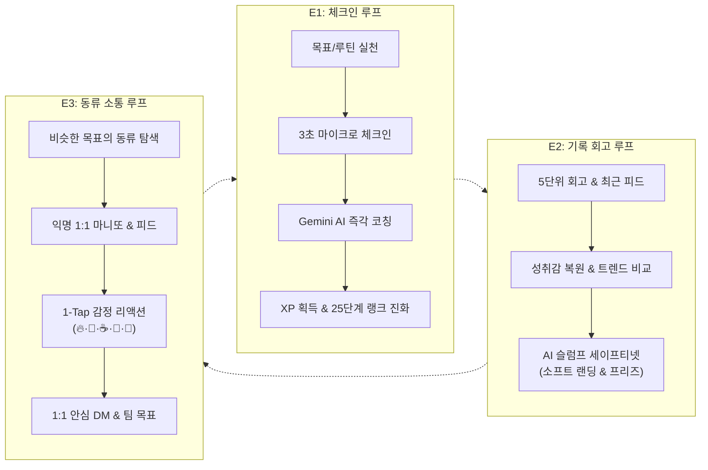
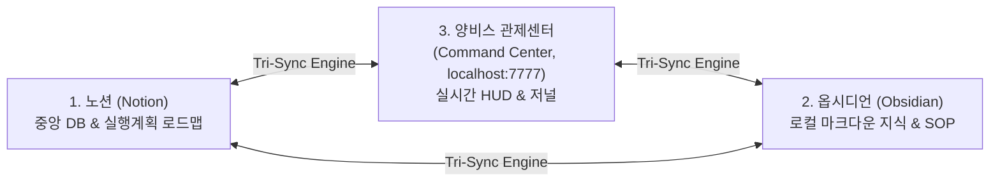

# 📘 아워골(OurGoal) 올인원 종합 인수인계서 (Master Architecture, Domain & Operation Manual)

> **문서 버전**: v2026.09.22 (Supreme Edition - Multi-Actor Court & 25-Rank Evolution Updated)  
> **대상 독자**: 아워골 프로젝트를 처음 접하는 모든 비개발자, 신규 기획자, 개발자, AI 에이전트  
> **출력용 HTML**: [`docs/guide/OURGOAL_HANDOVER_MANUAL.html`](file:///C:/dev/ourgoal-app/docs/guide/OURGOAL_HANDOVER_MANUAL.html) (브라우저에서 열어 Ctrl+P 또는 인쇄 버튼으로 A4/PDF 완벽 출력 가능)  
> **최고 정본 기준**: `C:\Users\HP\AGENTS.md` (아워골 최고 헌법), `docs/rules/ESSENCE_OURGOAL.md` (도메인 본질 헌장), `docs/directives/ACTIVE.md` (지시함)

---

## 📑 전체 목차 (Table of Contents)

1. [아워골 한눈에 보기 (도대체 무슨 앱인가요?)](#1-아워골-한눈에-보기-도대체-무슨-앱인가요)
2. [창업 배경 및 3대 핵심 철학 (왜 만들었나요?)](#2-창업-배경-및-3대-핵심-철학-왜-만들었나요)
3. [서비스의 심장: 3대 본질 루프 (E1, E2, E3)](#3-서비스의-심장-3대-본질-루프-e1-e2-e3)
4. [25단계 아바타 랭크 진화 시스템 (성장 체감의 극대화)](#4-25단계-아바타-랭크-진화-시스템-성장-체감의-극대화)
5. [화면 구조 및 사용자 경험 지도 (IA & Screen Map)](#5-화면-구조-및-사용자-경험-지도-ia--screen-map)
6. [초정밀 기술 아키텍처 및 데이터 파이프라인 (Deep-Dive Engineering)](#6-초정밀-기술-아키텍처-및-데이터-파이프라인-deep-dive-engineering)
7. [3자 상호 동기화 체계 (Tri-Sync 원리)](#7-3자-상호-동기화-체계-tri-sync-원리)
8. [품질 헌법: 아워골 15대 조문과 개발 규범](#8-품질-헌법-아워골-15대-조문과-개발-규범)
9. [자동화 사법 체계: 법정(Court) 시스템 (무인 L4·L5 사법 혁신)](#9-자동화-사법-체계-법정court-시스템-무인-l4l5-사법-혁신)
10. [지시함(Directives) 거버넌스 체계 (ACTIVE.md)](#10-지시함directives-거버넌스-체계-activemd)
11. [디렉터리 맵 및 신규 작업자 6단계 퀵스타트 가이드](#11-디렉터리-맵-및-신규-작업자-6단계-퀵스타트-가이드)
12. [부록: 필수 용어 사전 (Glossary) & 트러블슈팅 FAQ](#12-부록-필수-용어-사전-glossary--트러블슈팅-faq)

---

## 1. 아워골 한눈에 보기 (도대체 무슨 앱인가요?)

> 💡 **비개발자를 위한 10초 비유**  
> 아워골(OurGoal)은 **"나를 위한 디지털 마음의 성소(Sanctuary)이자, 롤플레잉 게임(RPG)처럼 경험치를 쌓아 캐릭터를 키우는 나만의 AI 페이스메이커"**입니다.  
> 다른 사람에게 잘 보이기 위해 일상을 과시하는 인스타그램과 달리, **오롯이 나의 인생 목표와 매일의 작은 실천을 챙기며 '내가 올바른 방향으로 나아가고 있다'는 확신을 얻는 무공해 성장 도피처**입니다.

### 1.1 핵심 정의 및 존재 이유
현대인들은 매일 아침과 밤, 문득 **"내가 지금 제대로 올바르게 살고 있는 게 맞나? 앞으로 어떻게 나아가야 하지?"**라는 실존적인 삶의 방향성 불안을 느낍니다.  
시중에 수많은 투두(Todo) 앱과 습관 앱이 있지만, 며칠 바빠서 체크를 놓치면 스트릭(연속 기록)이 깨져 죄책감에 앱을 지워버리는 악순환이 반복됩니다.

아워골(OurGoal)은 이러한 보편적인 불안을 해소하기 위해 탄생했습니다:
1. **목표와 루틴의 입체적 연결**: 사소한 일상 루틴(물 마시기, 책 10분 읽기)이 내 인생의 궁극적 꿈(Goal)과 어떻게 연결되는지 시각화합니다.
2. **AI 지능형 페이스메이커**: 기록 즉시 Gemini AI가 내 상황을 공감하고 실질적인 다음 행동을 1.5초 만에 제안합니다.
3. **지속 가능한 완주 돕기**: 하루 이틀 실패해도 자책하지 않도록 스트릭 프리즈(연속 기록 방어권)와 AI 소프트 랜딩(난이도 조절)을 제공합니다.

### 1.2 아워골을 표현하는 5대 핵심 숫자

| 지표 | 수치 | 의미 및 역할 |
| :--- | :---: | :--- |
| **만화 아바타 세계관** | **320종** | 얼굴 사진이나 실명 공개 부담 없이, 나를 대변하는 매력적인 캐릭터로 활동하는 100% 안전한 익명 공간. |
| **아바타 랭크 진화** | **25단계** | 매일 실천 시 1레벨 단위로 아바타 주변 프레임, 오라, 보석, 날개가 성장 진화하는 RPG 성장 체감 (Lv.1~25+). |
| **마이크로 체크인** | **3초** | 복잡한 타이핑 없이 탭 한 번, 사진 한 장, 한 줄 메모로 즉시 하루를 기록. |
| **입체 시간 아카이브** | **5단위** | 오늘, 1주일, 1달, 1년, 사용자 지정 기간 등 5가지 관점에서 나의 노력을 반추. |
| **무공해 감정 리액션** | **1-Tap** | 악플이나 긴 댓글 피로감 없이 5가지 감정(🔥 열정, 👏 축하, ☕ 위로, 💪 리스펙, 🚀 응원)을 원터치로 교환. |

---

## 2. 창업 배경 및 3대 핵심 철학 (왜 만들었나요?)

> 💡 **비개발자를 위한 비유: 소음 가득한 번화가 vs 조용한 산사(山寺)**  
> 기존 SNS가 화려한 옷을 입고 남들에게 인정받으려 경쟁하는 '시끄러운 번화가'라면,  
> 아워골은 문을 닫고 들어와 오롯이 내 호흡과 성장에 집중할 수 있는 **'아늑하고 조용한 힐링 산사'**입니다.

### 2.1 기존 서비스들의 3대 고질적 문제와 아워골의 해법

| 구분 | 기존 솔루션 (습관 앱, SNS) | 아워골(OurGoal)의 혁신 해법 |
| :--- | :--- | :--- |
| **심리적 피로** | 타인의 완벽한 일상 구경으로 박탈감과 자괴감 유발 | **무공해 성장 도피처**: 랭킹·비교 전면 배제, 익명 마니또 연대 |
| **작심삼일 이탈** | 하루 이틀 체크 누락 시 연속 기록 파괴 ➔ 죄책감에 앱 삭제 | **슬럼프 세이프티 넷**: 스트릭 프리즈(방어권) & AI 난이도 완화 제안 |
| **목표와의 단절** | 사소한 루틴과 내 인생 궁극적 꿈의 연결고리가 없음 | **RPG식 경험치(XP)**: 루틴 체크 시 상위 목표 진행률 게이지 즉각 상승 |

### 2.2 아워골의 3대 절대 철학
1. **320종 만화 아바타 세계관**: 외모, 나이, 직업, 성별에 따른 선입견을 원천 차단합니다. 320종의 만화 아바타로 자유롭게 나를 표현합니다.
2. **연속성 히트맵(Heatmap) 단일화**: '잔디'라는 비표준 은어를 영구 금지하고, 내가 살아온 날들의 성실한 색상이 누적되는 **'히트맵'**으로만 단일 표기합니다. (코드 및 UI 전 영역 강제).
3. **무공해 동류 연대**: 자극적인 쓰레기 숏폼과 배너 광고를 일절 거부하며, 같은 목표를 향해 달리는 동료와의 담백한 응원만을 나눕니다.

### 2.3 착한 수익화 모델: BM 4대 규범
아워골은 사용자의 사용 경험을 볼모로 잡고 결제를 강요하거나 강제 광고를 띄우지 않습니다:
- **아바타 다양화**: 코어 기능은 100% 무료. 아바타 수집은 순수 자기만족 꾸미기 영역으로만 제한.
- **타 유저의 잇템 커머스**: 멘토의 프로필에서 실제로 도움을 받은 책이나 도구를 내가 진심으로 원할 때만 자발적 구매.
- **템플릿 복사 리워드**: 다른 사람의 훌륭한 목표 계획표를 내 것으로 복사할 때만 감사의 뜻으로 자발적 1회 광고 시청 (**※ 서비스 런칭 초기에는 광고 전면 배제**).
- **크리에이터 선순환**: 좋은 템플릿을 만든 사용자에게 크레딧과 수익이 돌아가는 지속 가능한 생태계.

---

## 3. 서비스의 심장: 3대 본질 루프 (E1, E2, E3)

> 💡 **비개발자를 위한 비유: 자동차의 3대 구동축**  
> 아워골이라는 자동차는 3개의 엔진 축으로 굴러갑니다:  
> • **E1 (체크인)**: 오늘 하루 달린 거리를 기록하는 계기판  
> • **E2 (회고)**: 지나온 길을 돌아보고 다음 코스를 정비하는 정비소  
> • **E3 (소통)**: 옆 차선에서 함께 나란히 달리는 페이스메이커 친구들



### 3.1 E1: 체크인 루프 (Check-in Loop)
- **실행 흐름**: 일상 실천 ➔ 3초 한 줄 체크인(텍스트/사진) ➔ AI 실시간 테마 분류(공부/운동/업무/심리/약속) ➔ Gemini AI 맞춤형 칭찬 및 다음 액션 1문장 제안 ➔ RPG 경험치(XP) 획득, 레벨 상승, 히트맵 타일 색칠.
- **핵심 감각**: 단순한 체크박스 지우기가 아니라 내 인생의 큰 꿈에 벽돌이 쌓이는 **"RPG 퀘스트 완료 효능감"**을 매일 체감합니다.

### 3.2 E2: 기록 회고 루프 (Reflection Loop)
- **5단위 시간 여행 아카이브**: 오늘, 이번 주(위클리 리캡 카드), 이번 달(월간 히트맵), 올해(연간 라이프 궤적), 기간 설정(시험/프로젝트 기간) 등 5단위로 나의 노력을 조망.
- **최신 피드 및 통계 트렌드 (TASK-ES-202 반영)**: 기록 탭 진입 시 최근 3개 실시간 기록 카드가 최상단에 직관적으로 노출되며, 과거 기록은 부드러운 페이징 네비게이션으로 탐색. 주간/월간 비교 그래프를 탭 하나로 전환하는 트렌드 스위처 제공.
- **슬럼프 세이프티 넷**: 3일 이상 기록이 멈추면 "페이스를 조금 낮춰볼까요?"라며 AI가 목표 강도를 30% 낮추거나 마일스톤 기한을 늘려주는 따뜻한 안전망을 가동합니다.

### 3.3 E3: 동류 소통 루프 (Peer Connection Loop)
- **익명 1:1 마니또**: 일주일간 비슷한 목표를 가진 익명 친구와 1:1 수호천사 매칭. (24시간 동안 상대방이 응답하지 않으면 백그라운드 AI가 대신 따뜻한 응원을 전송하여 고독 방지).
- **1-Tap 무공해 리액션**: 긴 글 대신 5종 감정 아이콘을 원터치로 교환하여 감정 소모 제로.
- **함께 달리는 팀 목표**: 친구, 동료들과 같은 방에 모여 서로의 실천을 투명하게 확인하고 지지.

---

## 4. 25단계 아바타 랭크 진화 시스템 (성장 체감의 극대화)

> 💡 **비개발자를 위한 10초 비유: 포켓몬스터 진화와 기사단의 훈장**  
> 작은 씨앗에서 시작해 울창한 숲이 되고, 거대한 바다와 천둥 번개를 거쳐 마침내 온 우주를 다스리는 신화적 존재가 됩니다!  
> 5레벨마다 큰 테마가 바뀌고, **매 1레벨(100 XP)을 달성할 때마다** 아바타 주변의 날개, 덩굴, 광원 보석이 한 단계씩 눈에 띄게 진화합니다.

### 4.1 5대 상징 랭크 × 5단계 세부 성장 매트릭스 (총 25단계)

아워골은 단순한 숫자에 불과했던 레벨 시스템을 시각적 예술과 즉각적 보상으로 승화시켰습니다:

| 랭크 테마 | 레벨 범위 | 상징 색상 및 비주얼 테마 | 1레벨 단위 5단계(I~V) 점진 진화 상세 |
| :--- | :---: | :--- | :--- |
| **🌱 새싹 (Sprout)** | **Lv.1 ~ 5** | 싱그러운 연둣빛 & 에메랄드 그린 | • **Lv.1 (I)**: 아기 씨앗에서 갓 돋아난 쌍떡잎 1쌍 + 투명 이슬방울 프레임<br>• **Lv.2 (II)**: 활짝 벌어진 떡잎과 좌우 생명의 줄기선<br>• **Lv.3 (III)**: 세 잎 클로버 형상 본잎 + 은은한 초록빛 아우라<br>• **Lv.4 (IV)**: 풍성한 네 잎 덩굴 아치 + 상단 아기 꽃봉오리 엠블럼<br>• **Lv.5 (V - Master)**: 활짝 피어난 생명의 꽃망울 + 황금빛 이슬 보석 + 숲의 기운 오로라 |
| **🌲 울창한 숲 (Forest)** | **Lv.6 ~ 10** | 깊고 그윽한 딥 포레스트 그린 | • **Lv.6 (I)**: 단단한 참나무 묘목 프레임 + 짙은 녹음의 나뭇잎 윙<br>• **Lv.7 (II)**: 좌우로 힘차게 뻗은 푸른 잔가지들과 피톤치드 오라<br>• **Lv.8 (III)**: 고대 숲의 수호목 룬 문양 + 싱그러운 나뭇잎 왕관<br>• **Lv.9 (IV)**: 황금 도토리와 에메랄드 보석이 박힌 세계수 가지 아치<br>• **Lv.10 (V - Master)**: 숲 전체를 수호하는 에인션트 트리 문장 + 찬란한 나뭇잎 오라 |
| **🌊 포세이돈 (Poseidon)** | **Lv.11 ~ 15** | 청량한 마린 블루 & 코발트 심해 | • **Lv.11 (I)**: 시원한 푸른 파도 물결 테두리 + 튀어오르는 물방울 윙<br>• **Lv.12 (II)**: 소용돌이치는 급류 아치 + 심해의 신비로운 딥블루 빛무리<br>• **Lv.13 (III)**: 파도를 가르는 아쿠아 삼지창 심볼 + 산호 크레스트<br>• **Lv.14 (IV)**: 솟구치는 거대한 해일 날개 + 사파이어 보석 프레임<br>• **Lv.15 (V - Master)**: 포세이돈의 황금 삼지창 엠블럼 + 크라켄 파도 오라 |
| **⚡ 제우스 (Zeus)** | **Lv.16 ~ 20** | 눈부신 앰버 골드 & 천둥 번개 | • **Lv.16 (I)**: 날카로운 지그재그 번갯불 테두리 + 황금빛 스파크 윙<br>• **Lv.17 (II)**: 좌우로 교차하며 내리꽂히는 쌍번개 아치 + 일렉트릭 글로우<br>• **Lv.18 (III)**: 벼락이 집약된 천둥 방패 엠블럼 + 올림포스 구름 프레임<br>• **Lv.19 (IV)**: 폭풍우를 가르는 신성한 벼락 날개 + 앰버 토파즈 보석<br>• **Lv.20 (V - Master)**: 제우스의 신검 벼락 엠블럼 + 찬란한 황금빛 썬더 아우라 |
| **🌌 코스믹 우주 (Cosmic)** | **Lv.21 ~ 25+** | 신비로운 딥 바이올렛 & 성운 펄서 | • **Lv.21 (I)**: 보랏빛 행성 궤도 링 + 미니 은하수 성운 윙<br>• **Lv.22 (II)**: 회전하는 은하 팔(Spiral Arms)과 유성우 궤적<br>• **Lv.23 (III)**: 초신성 폭발(Supernova) 성간 가스 + 보이드 크리스탈<br>• **Lv.24 (IV)**: 은하계 3중 궤도 링 + 반짝이는 별자리 성도<br>• **Lv.25+ (V - Master)**: 차원을 초월한 펄서 엠블럼 + 무한 코스믹 아우라 |

### 4.2 5중 결합 아바타 샌드위치 프레임 엔지니어링
아바타 렌더링 엔진(`js/avatar-system.js`)은 무거운 외부 이미지 파일 없이 **100% 초경량 인라인 SVG 벡터(0ms 로딩)**로 렌더링됩니다. 아바타 원본 얼굴을 1픽셀도 가리지 않도록 5개 레이어가 완벽히 샌드위치 구조로 결합됩니다:
```
[레이어 1: 최하단] 외곽 펄스 및 오로라 광원 (Glow Filter)
[레이어 2: 날개층] 1레벨 단위로 성장하는 양옆 윙/식물 줄기/번개 날개
[레이어 3: 본체층] 사용자 프로필 사진 또는 320종 만화 아바타 본체
[레이어 4: 테두리] 고품격 크레스트 테두리 및 상단 보석 엠블럼
[레이어 5: 최상단] 우측 하단 로마숫자 서브티어(I~V) 배지 칩
```

---

## 5. 화면 구조 및 사용자 경험 지도 (IA & Screen Map)

> 💡 **비개발자를 위한 비유: 집의 구조**  
> 아워골 앱은 잘 정돈된 아름다운 주택과 같습니다:  
> **현관(랜딩/로그인)** ➔ **거실(홈 성소)** ➔ **서재(목표 탭)** ➔ **달력 벽면(일정 탭)** ➔ **기록 보관함(기록 탭)** ➔ **마당(소통 탭)** ➔ **드레스룸(설정 탭)**

```
┌────────────────────────────────────────────────────────────────────────┐
│  [TopBar] 로고 (아워골) | 💡 활용법 | 🔔 알림센터 | 25단계 랭크 아바타  │
├────────────────────────────────────────────────────────────────────────┤
│                                                                        │
│  [Main Screens]                                                        │
│  ├── screen-home     : Focus Sanctuary V2 (오늘의 몰입, 루틴, XP)      │
│  ├── screen-goals    : 목표 / 마일스톤 / 루틴 / 150+ 템플릿 서고      │
│  ├── screen-calendar : 캘린더 (월간 그리드 / 주간 타임라인 / 일일)     │
│  ├── screen-records  : 5단위 회고 / 최근 피드 / 트렌드 스위처 / 히트맵 │
│  ├── screen-comm     : 40인 블렌디드 피드 / 1:1 마니또 / 안심 DM       │
│  └── screen-settings : 320종 아바타 보관함 / 테마 / CSV 안전 백업      │
│                                                                        │
├────────────────────────────────────────────────────────────────────────┤
│  [BottomNav]  [홈]   [목표]   [ ➕ 빠른체크인 FAB ]   [일정]   [기록]   [소통] │
└────────────────────────────────────────────────────────────────────────┘
```

### 5.1 6대 핵심 화면 상세 안내
1. **홈 (Focus Sanctuary V2, `screen-home`)**:
   - 앱의 중심 거실. 오늘의 핵심 루틴, 연속 실천 스트릭, 미니 히트맵, 집중 타이머, 25단계 랭크 성장 아바타가 유기적으로 배치됨.
2. **목표 (`screen-goals`)**:
   - `Goal ➔ Milestone ➔ Daily Routine`의 3단계 입체 트리 구조. iOS Safe Area 상단 인셋과 서브탭 알약 네비게이션이 복구되어 스크롤 간섭 없이 쾌적하게 관리.
3. **일정 (`screen-calendar`)**:
   - 월간 달력과 주간 타임라인을 넘나들며, 특정 날짜에 어떤 목표 루틴을 실천했는지 양방향 매핑 확인.
4. **기록/통계 (`screen-records`)**:
   - 5단위 아카이브, 최근 3개 피드 및 페이저, 일간/주간/월간 트렌드 스위처, 전수 히트맵 풀스크린.
5. **소통 (`screen-comm`)**:
   - 40인 블렌디드 피드, 1:1 익명 마니또 룸, 1-Tap 5종 리액션 교환, 팀 목표 대화방.
6. **설정 (`screen-settings`)**:
   - 320종 만화 아바타 선택 및 보관함, 다크/라이트 테마 원터치 전환, 데이터 CSV 안전 백업.

### 5.2 중앙의 황금 버튼: 빠른 체크인 FAB
화면 하단 네비게이션 중앙의 플로팅 버튼(FAB, ➕)을 누르면 어느 화면에서든 0.1초 만에 체크인 입력창으로 포커스가 이동하여 즉시 실천을 기록할 수 있습니다.

---

## 6. 초정밀 기술 아키텍처 및 데이터 파이프라인 (Deep-Dive Engineering)

> 💡 **비개발자를 위한 1분 비유: 아워골의 컴퓨터 뒤편**  
> • **화면(프론트엔드)**: 앱스토어 설치 없이 링크만 누르면 1초 만에 뜨는 초경량 웹 앱 (React 없이 순수 자바스크립트로 만들어져 로딩 속도가 번개처럼 빠름)  
> • **배달원(서버리스 API)**: 주문을 주방에 전달하고 음식을 가져오는 신속한 배달 오토바이  
> • **중앙 금고(Supabase DB)**: 손님들의 소중한 포인트와 일기가 보관된 절대 털리지 않는 은행 금고  
> • **내 주머니(IndexedDB / localStorage)**: 인터넷이 끊겨도 볼 수 있게 내 스마트폰에 임시 보관하는 비상용 메모장  
> • **인공지능 코치(Gemini API)**: 체크인을 읽고 1.5초 만에 응원과 실천 팁을 적어주는 전담 AI 코치

### 6.1 시스템 구조 다이어그램 (System Architecture)

```
[클라이언트: 스마트폰 PWA / 데스크톱 웹]
   │ (Pure Vanilla JS SPA + PWA Service Worker `sw.js` + Web Push)
   ├── 스마트 3계층 스토리지: [IndexedDB: 고화질 사진/오프라인] | [localStorage: UI 캐시]
   │
   ├── [HTTP REST API 요청] ────────────────────────┐
   │                                                ▼
   │                                 [Vercel Serverless Functions (`api/`)]
   │                                 ├── `feedback.js`   : Gemini AI 심층 코칭 생성
   │                                 ├── `goalagent.js`  : 목표 ➔ 마일스톤 자동 분해
   │                                 ├── `push-*.js`     : Web Push 백그라운드 발송
   │                                 └── `track.js`      : 사용자 여정 계측
   │                                                │
   │ [직접 보안 통신 (Supabase JS Client)]          ▼
   ▼                                          [외부 최신 AI 엔진]
[원격 영구 정본 원장: Supabase (PostgreSQL)] ◄── Google Gemini Flash API
   ├── Row Level Security (RLS 엄격 분리: 본인 데이터만 접근)
   ├── Realtime Broadcast (웹소켓 실시간 피드/알림 스트리밍)
   └── Storage Bucket (프로필/인증 미디어 암호화 저장)
```

### 6.2 핵심 8대 데이터베이스 테이블 상세 명세

| 테이블명 | 주요 컬럼 및 타입 | 제약조건 / RLS 보안 정책 | 역할 및 비즈니스 의미 |
| :--- | :--- | :--- | :--- |
| **`users`** | `id (uuid, PK)`, `email (text)`, `avatar_id (text)`, `xp (integer)`, `xp_level (integer)`, `streak (integer)`, `settings (jsonb)` | 본인 row만 UPDATE 가능. 프로필 공개 필드는 누구나 SELECT | 사용자 계정 정본 원장, 25단계 랭크 성장 수치, 320종 아바타 설정값 보관 |
| **`goals`** | `id (uuid, PK)`, `user_id (uuid, FK)`, `title (text)`, `category (text)`, `progress (integer)`, `created_at (timestamptz)` | `auth.uid() = user_id` 조건으로 완전 격리 | 상위 인생 청사진 목표 원장 (최대 10개 핵심 목표 관리) |
| **`milestones`** | `id (uuid, PK)`, `goal_id (uuid, FK)`, `title (text)`, `order_index (int)`, `is_completed (boolean)` | 상위 goal의 소유자만 쓰기 권한 부여 | 목표 달성을 위한 중간 디딤돌 단계 (1개 목표당 3~5개 구성) |
| **`checkins`** | `id (uuid, PK)`, `user_id (uuid, FK)`, `goal_id (uuid, FK)`, `content (text)`, `theme (text)`, `ai_feedback (text)`, `image_url (text)` | 본인 쓰기, 공개 설정 시 커뮤니티 피드 조회 허용 | 일일 3초 체크인 원장, Gemini AI 피드백 텍스트 영구 기록 |
| **`content_reactions`**| `id (uuid, PK)`, `target_id (uuid)`, `user_id (uuid, FK)`, `reaction_type (text)` | 1인당 대상 글에 동일 리액션 1회 유니크 제약 | 1-Tap 무공해 5종 감정 리액션(🔥, 👏, ☕, 💪, 🚀) 원장 |
| **`manitto_matches`** | `id (uuid, PK)`, `giver_id (uuid)`, `receiver_id (uuid)`, `week_id (text)`, `status (text)` | 매칭된 양 당사자만 SELECT 가능 | 1:1 익명 마니또 매칭 및 활동 상태 기록 |
| **`team_goals`** | `id (uuid, PK)`, `title (text)`, `category (text)`, `leader_id (uuid)`, `members (jsonb)` | 팀 소속 멤버만 읽기/쓰기 허용 | 동류 연대 팀 목표 룸 원장 |
| **`user_rank_history`**| `id (uuid, PK)`, `user_id (uuid)`, `old_level (int)`, `new_level (int)`, `rank_title (text)`, `unlocked_at (timestamptz)` | 시스템 및 본인 SELECT 가능 | 25단계 랭크 승급 감사 로그 및 명예의 전당 기록 |

### 6.3 4대 핵심 데이터 파이프라인

#### ⚙️ 파이프라인 1: 0.01초 낙관적 체크인 & Gemini AI 150자 코칭
1. **낙관적 UI 반영**: 유저가 텍스트 입력 후 '기록'을 누르는 즉시(0.01초) 화면의 스트릭과 히트맵을 +1 증가시키고 XP 게이지를 올림 (체감 딜레이 제로).
2. **원격 비동기 적재**: 백그라운드에서 Supabase `checkins` 테이블로 비동기 INSERT.
3. **AI 프롬프트 생성**: `/api/feedback` 서버리스 함수로 체크인 내용, 목표 제목, 유저 컨디션 전달.
4. **Gemini Flash 추론**: 150자 이내의 공감과 실천적 다음 스텝 도출 (평균 응답속도 1.2초).
5. **화면 렌더링**: 완성된 AI 코칭 텍스트가 카드에 타이핑 효과로 출력되며 Supabase 원장에 업데이트.

#### ⚙️ 파이프라인 2: 3계층 스마트 스토리지 헌법 (3-Tier Storage Mandate)
- **Tier 1 (Supabase 원격 원장)**: 데이터의 절대 정본(Single Source of Truth).
- **Tier 2 (로컬 IndexedDB)**: 고화질 인증 사진, 오프라인 미전송 체크인 큐 보관 (용량 제한 없음).
- **Tier 3 (로컬 localStorage)**: 다크모드 여부, 접힘 상태 등 단순 UI 세팅값만 가볍게 보관하여 용량 초과 에러(`QuotaExceededError`)를 원천 차단.

#### ⚙️ 파이프라인 3: 4대 뷰 동시 전파 헌법 (Simultaneous 4-View Propagation)
데이터가 1건이라도 변경되면 화면 간 상태 불일치를 막기 위해 아래 4개 렌더러가 반드시 동시에 호출됩니다:
```javascript
renderHome();           // 1. 홈 성소 대시보드 갱신
renderRecordsScreen();  // 2. 기록 회고 화면 갱신
renderStatsScreen();    // 3. 통계 및 히트맵 갱신
renderCalendar();       // 4. 캘린더 일정 뷰 갱신
```

#### ⚙️ 파이프라인 4: 25단계 아바타 랭크 진화 & XP 레벨업 파이프라인
체크인(+100 XP) 또는 마일스톤 완주(+300 XP) 발생 시:
1. `state.profile.settings.xp.total` 누적.
2. `levelProgress(xp)` 순수 함수를 통해 1레벨 단위 현재 레벨(`1~25+`)과 5대 상징 랭크(`새싹~코스믹`) 및 서브티어(`I~V`) 자동 산출.
3. 상단바 프로필 배지와 메인 레벨 카드의 인라인 SVG 샌드위치 프레임이 즉각 새로운 비주얼로 리렌더링.

---

## 7. 3자 상호 동기화 체계 (Tri-Sync 원리)

> 💡 **비개발자를 위한 비유: 세 쌍둥이 장부**  
> 아워골 프로젝트는 기획서, 업무 일지, 실제 코드가 따로 놀지 않도록 **3개의 장부를 실시간으로 똑같이 맞춰놓는 '세 쌍둥이 동기화 시스템'**을 갖추고 있습니다.  
> 어느 한 곳에서 글을 고치면 나머지 두 곳에도 자동으로 복사되어, "누가 옛날 문서를 보고 엉뚱하게 일하는 참사"를 원천 차단합니다.



1. **노션 (Notion)**: 팀 전체가 한눈에 확인하는 중앙 데이터베이스 정본, 공식 로드맵, 티켓 대시보드.
2. **옵시디언 (Obsidian)**: 로컬 마크다운 지식 백과 정본. 요구사항 정의서(REQ)와 작업계획서(PLAN) 보관.
3. **양비스 관제센터 (Command Center)**: 개발자 로컬 머신(`localhost:7777`)에서 실시간으로 구동되는 지휘 HUD, 작업 연계, 저널 기록.
- **동기화 검증 명령어**:
  ```bash
  node C:/dev/command-center/lib/tri-sync.js check   # 3자 동기화 무결성 상태 점검 (100% 확인)
  node C:/dev/command-center/lib/tri-sync.js sync    # 3자 실시간 강제 동기화
  ```

---

## 8. 품질 헌법: 아워골 15대 조문과 개발 규범

> 💡 **비개발자를 위한 비유: 국가의 헌법과 법률**  
> 아워골 프로젝트에는 타협할 수 없는 **'국가의 헌법'**이 있습니다.  
> 개발자나 AI가 제멋대로 코드를 줄이거나 가짜로 버튼을 만드는 꼼수를 쓰지 못하도록 15가지 최고 헌법 조문으로 행동을 엄격히 통제합니다.

### 8.1 5대 필수 승인선 (AI나 개발자가 단독 결정할 수 없는 5가지)
아래 5가지 중 하나라도 해당하면, 무조건 작업을 멈추고 최고결정권자(상민님)의 명시적 승인을 받아야 합니다:
1. **① 돈 (Financial)**: 유료 클라우드 API 호출 추가, 결제 모듈 변경, 인프라 비용 증설 등.
2. **② 개인정보 (Privacy)**: 유저 이메일, 닉네임, 로그인 방식 등 민감 정보 수집 및 보안 정책 변경.
3. **③ 기존 기능 삭제**: 이미 잘 돌아가던 버튼, 화면, 기능의 영구적 제거.
4. **④ 되돌릴 수 없는 바깥 행위**: 원격 main 브랜치 병합(Merge), 실제 운영 서버 배포, 라이브 DB 직접 수정.
5. **⑤ 규범 변경**: 헌법 조항 수정, 전역 개발 규칙 개정.

### 8.2 6대 핵심 고질병 원천 근절 선언
1. **1호 되던 기능 먹통 (Regression)**: 기존 정상 작동 요소 파괴 금지.
2. **2호 껍데기 버튼 방치 (Dead Click)**: 마크업만 있고 클릭 리스너나 로직이 누락된 버튼 생성 금지.
3. **3호 상호연계 기능 고립 (Disconnected Features)**: 다른 화면과 연동되지 않는 외톨이 설계 금지.
4. **4호 유저 데이터 유실 (Data Loss)**: 업데이트나 마이그레이션 시 단 1바이트의 유저 자산 유실도 불허.
5. **5호 화면 간 상태 불일치 (State Desynchronization)**: 한 화면 변경 시 4대 뷰 동시 전파.
6. **6호 가짜 실제구현 (Fake Real-Implementation)**: 실계정 간 통신 없이 로컬 가상 봇이나 setTimeout 타이머로 상호작용을 위장하는 눈속임 행위 엄단.

### 8.3 4위 1체 배선 헌법 (껍데기 UI 영구 금지)
새로운 요소를 만들 때는 반드시 **① 마크업(HTML) + ② 클릭 리스너 + ③ 실제 비즈니스 로직 + ④ 사용자 피드백**의 4가지가 한 몸으로 완성되어야 합니다. (CSS `display: none` 편법 은폐 금지).

### 8.4 문제해결 2중 8원칙 (REQ ➔ PLAN)
모든 작업은 코딩 전, 상민님이 제정하신 문제해결 8원칙을 2번 거칩니다:  
**1단계 기획 관점(요구사항 정의서 REQ)** ➔ **2단계 엔지니어링 실행 관점(작업계획서 PLAN)**.

---

## 9. 자동화 사법 체계: 법정(Court) 시스템 (무인 L4·L5 사법 혁신)

> 💡 **비개발자를 위한 비유: 학생의 자가채점 vs 공인 수능 시험장**  
> 예전에는 개발자가 코드를 고쳐놓고 스스로 채점하며 "모든 테스트 100% 통과했습니다!"라고 자랑했습니다. 하지만 막상 앱을 켜보면 버튼이 안 눌리는 가짜 통과가 많았습니다.  
> 아워골의 **'법정(Court)'**은 학생의 말을 전혀 믿지 않는 **독립된 공인 시험 감독관**입니다.  
> 개발자가 건드릴 수 없는 GitHub 클라우드에서 실제 브라우저를 띄워 마우스를 직접 딸깍딸깍 클릭해 보고 진짜 작동할 때만 합격증을 발급합니다.

### 9.1 판정 분리 원칙: 작업자는 '주장'만 쓴다
작업자는 "이 기능을 고쳤습니다"라는 시나리오를 `reports/작업번호/claims.json` 파일에 기록해 제출할 뿐, 스스로 "통과했다"고 말할 수 없습니다. 판정은 오직 독립 엔진(`court/judge.js`)만이 내립니다.

### 9.2 법정의 4대 판정 결과

| 판정 | 의미 | 병합 가능 여부 |
| :--- | :--- | :---: |
| **통과 (Pass)** | 지시 항목에 걸린 시험이 전부 고치기 전 실패 ➔ 고친 뒤 성공으로 행동 변화가 입증됨. 기존 기능 회귀 0건. | **가능** |
| **확인 부족 (Needs Review)** | 결함은 없으나, 외부 차단이나 금고 파일 변경 등 컴퓨터가 혼자 다 확인하지 못한 항목이 남아있음을 알림. | **가능 (알고 결정)** |
| **돌려보냄 (Rejected)** | 되던 기능이 고장 났거나, 주장이 거짓이거나, 채점 기준을 몰래 고쳤거나, 잴 수 있는데 안 쟀음. 즉시 재작업. | **불가** |
| **심사 못 함 (Tool Error)** | 법정 도구 자체의 타임아웃이나 인프라 고장으로 심사를 끝내지 못함. (통과가 아님). | **불가** |

### 9.3 확인 수준 6단계 사다리 (Grade Floors) 및 무인 자동화 혁신

> 🚀 **TASK-ES-203 혁신 반영**: 기존에 사람의 수동 조작(`[손 필요]`)에 의존하던 5단계(L4)와 6단계(L5)가 **법정 시나리오 엔진의 듀얼 브라우저 인스턴스 격리 기동 및 CDP 하드웨어 신호 모의를 통해 무인(Headless) 자동화로 전면 편입**되었습니다!

| 수준 | 서수 | 뜻 | 검증 방식 (TASK-ES-203 최신화) |
| :--- | :---: | :--- | :--- |
| **확인 못 함** | `L0` | 아직 물리적으로 확인하지 못함 | 미검증 상태 (측정 실패가 아닌 정직한 상태 보고) |
| **글자만 봄** | `L1` | 코드·설정 파일에 텍스트가 적혀 있는 것만 확인 | 정적 파일 정규식/AST 구문 분석 |
| **부품만 돌려 봄** | `L2` | 개별 함수나 모듈 단위로 독립 실행 | Node.js 단위 시험 runner (`unit.js`) |
| **PC 화면에서 눌러 봄** | `L3` | 실제 Chrome 브라우저에서 마우스로 클릭하고 렌더링 확인 | Puppeteer/CDP 기반 자동 마우스 클릭 & DOM 단언 |
| **진짜 계정끼리 해 봄** | `L4` | **실시간으로 2개 계정이 서로 메시지나 응원을 주고받음** | **[법정 무인 자동화]** `spawnPeer`로 2번째 독립 Chrome 인스턴스를 동시 기동하여 실시간 소통 교차 단언 |
| **진짜 폰에서 해 봄** | `L5` | **모바일 기기 물리 뒤로가기 키 및 가상 키보드 반응** | **[법정 무인 자동화]** CDP 하드웨어 신호 모의(`hardwareBack`, `virtualKeyboard`)로 OS 물리 반응 자동 검증 |

- **판정서 확인 정본 명령**:
  ```bash
  node court/chat.js <PR번호>   # GitHub Actions가 발행한 법정 판정서의 굵은 네 줄 머리말 추출
  ```

---

## 10. 지시함(Directives) 거버넌스 체계 (ACTIVE.md)

> 💡 **비개발자를 위한 비유: 대통령 결재함**  
> 팀 내 수많은 AI가 활동할 때 "누가 이 일을 시켰는가?"로 인한 혼선을 막기 위한 **공식 결재함**입니다.  
> 오직 최고결정권자(상민님)가 승인하여 원격 `origin/main`에 병합된 지시만 법적 효력을 가지며, 메신저 말이나 로컬 사본은 일체 효력이 없습니다.

### 10.1 3대 문서 위계 체계

| 문서 | 규정 내용 | 변경 주기 | 변경 권한 |
| :--- | :--- | :---: | :--- |
| **헌법 (`OURGOAL_ABSOLUTE_INTEGRITY_RULES.md`)** | **일하는 법** (어떻게 일하고 무엇이 완료인가) | 매우 드묾 | 상민님의 명시적 "헌법 개정 승인" + PR 병합 |
| **지시함 (`docs/directives/ACTIVE.md`)** | **지금 할 일** (오늘 누가 무엇을 수행하는가) | 수시 | 상민님이 승인해 병합한 PR (`CODEOWNERS` 통제) |
| **법정 판정서 (`REPORT.md`, `court/chat.js`)** | **결과 판정** (주장이 참이며 회귀가 없는가) | 작업마다 | GitHub 법정 엔진 (AI가 임의 작성 불가) |

### 10.2 양비스 자동 소환 (Auto-Summon) 규칙
지시함에 `- **실행**: 양비스 자동 소환`이 명시된 열린 지시는 관제센터 양비스가 새 세션을 띄워 자동으로 착수합니다. 단, 같은 지시는 최대 3회로 제한되며, 5대 승인선에 닿으면 즉시 멈추고 `[결심 필요]`로 보고합니다.

---

## 11. 디렉터리 맵 및 신규 작업자 6단계 퀵스타트 가이드

> 💡 **비개발자를 위한 비유: 건물의 층별 안내도**  
> 새로 합류한 팀원이 아워골 코드 창고에 들어왔을 때 헤매지 않도록 주요 방들의 위치를 정리한 안내판입니다.

### 11.1 핵심 파일 및 폴더 층별 안내
- `index.html`: 앱 전체의 뼈대 마크업이 담긴 메인 단일 파일 (32,000줄 규모의 초거대 SPA 중심부).
- `ui.css`: 앱 전체의 디자인 토큰, 색상 변수, 다크테마 스타일 (iOS Safe Area 상단 인셋 및 375px 모바일 반응형 완비).
- `js/avatar-system.js`: 320종 만화 아바타 세계관 및 25단계 랭크 성장 진화 인라인 SVG 프레임 엔진.
- `js/sanctuary-v3-engine.js`: 홈 화면(Focus Sanctuary) 메인 뷰 구동 엔진 (데일리 루틴, 빠른 체크인 입력).
- `js/streaks.js`: 연속 실천 스트릭 및 히트맵 타일 계산기 ('잔디' 단어 영구 금지).
- `js/universal-stats.js`: 통합 통계, 5단위 회고 차트, 레벨업 XP 엔진, 최근 피드 & 트렌드 스위처.
- `api/feedback.js`: Gemini AI 기반 맞춤형 코칭 피드백 서버리스 함수 (150자 이내 정밀 코칭 생성).
- `court/`: 독립 사법 시스템(법정)의 판정 엔진, L4/L5 듀얼 브라우저 시나리오 서고 (거짓 합격 원천 차단소).
- `docs/rules/`: 최고 헌법 및 도메인 본질 헌장 문서 보관함.
- `docs/directives/`: 상민님의 승인된 업무 지시함(`ACTIVE.md`).

### 11.2 신규 작업자 6단계 공식 실무 워크플로우
1. **지시함 확인 (Step 0)**: `git -C C:/dev/ourgoal-app fetch origin -q` 후 `git show origin/main:docs/directives/ACTIVE.md`를 읽고 나에게 부여된 지시 사항 확인.
2. **요구사항 정의 (REQ)**: 문제해결 8원칙 1회차 적용 ➔ `docs/specs/REQ-<기능명>.md` 작성.
3. **작업계획 수립 (PLAN)**: 엔지니어링 8원칙 2회차 적용 ➔ `docs/specs/PLAN-<기능명>.md` 작성.
4. **4위 1체 실제 구현**: 마크업 + 리스너 + 비즈니스 로직 + 피드백 동시 배선. 4대 뷰 동시 전파.
5. **주장 작성 및 예비 검사**: `reports/<작업번호>/claims.json` 작성 후 로컬에서 `npm test` 사전 점검.
6. **초안 PR 심사 청구**: GitHub에 PR을 올리고 독립 법정(Court)의 판정을 기다림. 상민님 결심 승인 후 원격 main 자동 배포. (**운영 서버 수동 직접 배포 `vercel --prod` 절대 금지**).

---

## 12. 부록: 필수 용어 사전 (Glossary) & 트러블슈팅 FAQ

### 12.1 15대 필수 용어 사전

| 용어 | 뜻과 중요성 |
| :--- | :--- |
| **아워골 (OurGoal)** | 삶의 방향성 불안을 해소하고 자기효능감을 복원하는 무공해 성장 성소이자 AI 페이스메이커. |
| **히트맵 (Heatmap)** | 매일의 실천과 노력이 누적되는 색상 타일 시각화. ('잔디' 단어 영구 금지). |
| **25단계 랭크 진화** | 새싹 ➔ 숲 ➔ 포세이돈 ➔ 제우스 ➔ 코스믹 5대 테마에 걸친 1레벨 단위 아바타 SVG 프레임 진화 시스템. |
| **320종 만화 아바타** | 얼굴/나이/외모 선입견 없이 누구나 편안하게 참여할 수 있는 100% 안전한 익명 페르소나. |
| **스트릭 프리즈 (Freeze)** | 부득이한 사정으로 체크인을 놓쳤을 때 연속 기록이 깨지지 않도록 지켜주는 심리적 안전망. |
| **소프트 랜딩 (Soft Landing)**| 3일 이상 슬럼프 발생 시 AI가 목표 난이도를 자동으로 30% 낮추어 완주를 돕는 코칭 시스템. |
| **E1 / E2 / E3** | 아워골의 3대 본질 축: E1(체크인 루프), E2(기록 회고 루프), E3(동류 소통 루프). |
| **4위 1체 배선** | [HTML 마크업 + 리스너 + 로직 + 사용자 피드백]이 완전하게 연결된 실제 구현 표준. |
| **3계층 스마트 스토리지** | Tier 1(Supabase 중앙 원장) + Tier 2(IndexedDB 대용량 미디어) + Tier 3(localStorage UI 캐시). |
| **4대 뷰 동시 전파** | 상태 불일치 방지를 위해 데이터 변경 시 Home, Records, Stats, Calendar를 동시에 갱신하는 헌법. |
| **Tri-Sync (3자 상호 동기화)**| 노션(중앙DB), 옵시디언(지식SOP), 관제센터(HUD/저널) 3곳을 완벽히 일치시키는 동기화 엔진. |
| **법정 (Court)** | GitHub 클라우드에서 실제 브라우저로 마우스를 눌러 회귀와 주장의 진실을 심사하는 무인 사법 체계. |
| **확인 수준 L0~L5** | 확인 못 함(L0)부터 듀얼 브라우저 통신(L4), 모바일 하드웨어 반응(L5)에 이르는 6단계 검증 사다리. |
| **5대 승인선** | 돈, 개인정보, 기능 삭제, 바깥 행위, 규범 변경 시 최고결정권자(상민님) 결심을 필수로 구하는 방화벽. |
| **지시함 (ACTIVE.md)** | 원격 `origin/main`에 병합된 것만 효력을 갖는 유일무이한 상민님의 업무 지시 거버넌스. |

### 12.2 트러블슈팅 FAQ

- **Q1. 체크인을 저장했는데 통계 화면에 반영이 안 됩니다.**
  - **A**: 4대 뷰 동시 전파가 누락되었는지 확인하세요. 데이터 변경 직후 `renderHome()`, `renderRecordsScreen()`, `renderStatsScreen()`, `renderCalendar()`가 모두 호출되어야 합니다.
- **Q2. 브라우저에서 `QuotaExceededError` 에러가 발생합니다.**
  - **A**: 용량이 큰 이미지나 배열 데이터를 `localStorage`에 넣지 않았는지 점검하세요. 고화질 사진이나 오프라인 큐는 반드시 `IndexedDB`에 저장해야 합니다.
- **Q3. 법정 판정에서 '돌려보냄'을 받았습니다.**
  - **A**: `node court/chat.js <PR번호>`로 판정서의 사유를 읽으세요. 되던 기능이 깨졌거나, `claims.json`의 시나리오가 거짓이거나, 금고 파일을 함께 건드렸을 가능성이 높습니다.
- **Q4. 3자 동기화(Tri-Sync) 검사에서 에러가 납니다.**
  - **A**: `node C:/dev/command-center/lib/tri-sync.js sync`를 실행해 노션과 옵시디언, 관제센터 간의 누락된 링크를 강제 재정렬한 후 `check`로 무결성을 재검증하세요.

---
*아워골(OurGoal) — 보통 사람들의 실존적 삶의 방향성 불안을 해소하는 무공해 성장 도피처*
