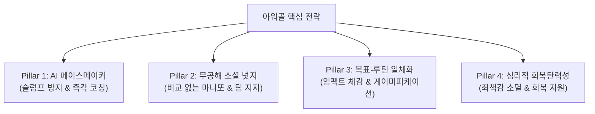
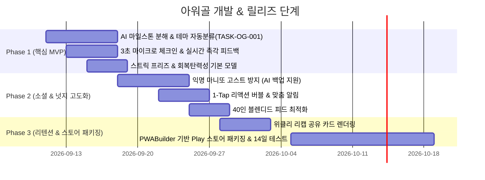

# 📋 [PRD] 아워골(OurGoal) 제품 요구사항정의서 (Product Requirements Document)

> **문서 버전**: v1.0  
> **작성일자**: 2026-09-10  
> **상태**: 승인 대기 (Draft for Review)  
> **핵심 가치**: "고립된 작심삼일을 끝내는 AI 페이스메이커 & 무공해 소셜 넛지 플랫폼"

---

## 1. 프로젝트 배경 및 목적 (Background & Objectives)

### 1.1 시장 배경 및 기회
* **검증된 시장 규모**: '마이루틴(MyRoutine)' 등 선도 앱이 다운로드 100만 회를 돌파하며 2030세대의 습관·루틴·자기관리(갓생) 수요는 확실히 검증되었습니다.
* **기존 솔루션의 한계**:
  * **전시형 SNS의 피로감**: 타인의 화려한 일상을 구경하며 느끼는 박탈감(현타)과 과시적 피드 피로도.
  * **의지력 중심의 고립된 기록**: 혼자 수동으로 체크하는 구조로 인해 3~7일 내 포기율(작심삼일)이 90%에 달함.
  * **목표와 루틴의 단절**: 사소한 일상 루틴(물 마시기 등)과 유저의 진짜 큰 꿈/목표(Goal)가 연결되지 않아 지속 동기 상실.
  * **실패 시 이탈 도미노**: 며칠 체크를 놓치면 죄책감과 스트릭 붕괴로 인해 앱을 아예 삭제하는 이탈 패턴.

### 1.2 아워골(OurGoal)의 제품 비전
아워골은 단순한 '체크박스형 루틴 플래너'를 넘어, **"목표(Goal) → 마일스톤(Milestone) → 데일리 루틴(Routine)"**의 유기적 구조 위에서 **AI 지능형 페이스메이커**와 **비교 없는 무공해 소셜 넛지(익명 마니또/팀 응원)**를 결합하여 **지속 가능한 목표 완주**를 돕는 차세대 성취 플랫폼입니다.

---

## 2. 제품 포지셔닝 및 경쟁 분석 (Positioning Matrix)

| 비교 축 | 마이루틴 (MyRoutine) | 일반 투두/습관 앱 (투두이스트, 해빗) | **아워골 (OurGoal)** |
| :--- | :--- | :--- | :--- |
| **관리 단위** | 루틴(반복 행동) 중심 | 할 일(Todo) 목록 중심 | **목표(Goal) ➔ 마일스톤 ➔ 일일 루틴의 입체적 연계** |
| **소셜 형태** | 공개 피드/팔로우 (전시·비교형) | 소셜 없음 (개인형) | **익명 마니또 & 팀 1-Tap 무공해 상호 지지** |
| **동기부여 수단** | 푸시 알람, 본인 의지, 유료 제약 | 알림, 위젯 | **Gemini AI 페이스메이커 (실시간 코칭·격려·조정)** |
| **실패 시 대응** | 스트릭 초기화 (사용자 이탈) | 알림 누적 (피로 유발) | **스트릭 프리즈 & AI 슬럼프 세이프티 넷 (목표 재조정)** |
| **진입 장벽** | 네이티브 앱 설치 필수, 유료 벽 존재 | 앱 설치 필수 | **PWA 3초 설치, 군더더기 없는 즉각적 웹-앱 경험** |

---

## 3. 핵심 페인포인트 해결 및 강점 극대화 전략 (Strategic Pillar)



1. **[강점 극대화] AI 지능형 페이스메이커**:
   * 목표를 넣으면 실행 가능한 단위(마일스톤/데일리 액션)로 즉시 쪼개줌.
   * 체크인 시 상투적인 칭찬이 아닌, 기록의 맥락(테마/감정)을 읽고 맞춤형 코칭 제공.
2. **[페인포인트 보완] 무공해 소셜 넛지 (Zero-Toxicity Social)**:
   * 팔로워 수, 완벽한 일상 자랑 등 '비교/박탈감' 유발 요소를 원천 차단.
   * "익명 마니또"와 "1-Tap 원터치 응원"을 통해 감정 소모 없이 든든한 연대감 형성.
3. **[페인포인트 보완] AI 백업 마니또 (Cold-Start & Ghost Safe)**:
   * 마니또 상대방이 잠수를 타거나 유저 수가 적을 때, AI가 자연스럽게 서포터로 개입하여 응원 공백 제거.
4. **[강점 극대화] 심리적 회복탄력성 (Resilience Mechanism)**:
   * 하루 실패해도 좌절하지 않도록 `스트릭 프리즈(Streak Freeze)` 및 `AI 소프트 랜딩(난이도 자동 완화)` 지원.

---

## 4. 상세 기능 요구사항 정의 (Functional Requirements)

### FR-01. AI 지능형 페이스메이커 & 마일스톤 분해

* **FR-01-01 [목표 ➔ 마일스톤 AI 자동 분해]**:
  * 사용자가 자유로운 줄글 형태로 목표를 입력하면, Gemini Flash API가 이를 분석하여 3~5단계의 마일스톤과 주간 반복 루틴 템플릿을 자동 생성해야 한다.
  * 생성된 결과는 사용자가 1-클릭으로 수정, 순서 변경, 삭제할 수 있어야 한다.
* **FR-01-02 [테마별 맞춤 심층 코칭 (Thematic AI Feedback)]**:
  * 체크인 기록 시 5대 테마(심리/멘탈, 공부/학습, 사업/업무, 약속/관계, 운동/건강)를 자동 인식(TASK-OG-001)하여, 테마에 최적화된 페르소나 톤으로 피드백을 생성해야 한다.
  * 피드백은 최대 150자 이내로 간결하며, `[공감 및 인정 1문장] + [실질적 인사이트/다음 제안 1문장]` 구조를 엄수해야 한다.
* **FR-01-03 [AI 슬럼프 세이프티 넷 & 소프트 랜딩]**:
  * 3일 연속 체크인이 누락되거나 달성률이 40% 미만으로 떨어질 경우, AI가 비난이나 경고 대신 "페이스 조절 제안"을 발행해야 한다.
  * 옵션 제공: ① 이번 주 목표 강도 30% 낮추기, ② 마일스톤 기한 1주일 연장, ③ '미니 회고' 진행 후 재시작.

### FR-02. 무공해 소셜 넛지 & 결속 시스템

* **FR-02-01 [익명 마니또 매칭 및 활동]**:
  * 유저는 비슷한 목표 카테고리를 가진 익명의 동료와 1:1 주간 마니또로 매칭된다.
  * 상대방의 프로필은 닉네임/아바타만 노출되며, 개인 식별 정보는 일절 차단된다.
* **FR-02-02 [1-Tap 원터치 응원 및 감정 리액션]**:
  * 긴 댓글 작성 부담을 없애기 위해 사전 정의된 5종의 마이크로 리액션(🔥 불꽃, 👏 박수, ☕ 따뜻한 위로, 💪 리스펙, 🚀 로켓)을 원터치로 발송할 수 있어야 한다.
  * 응원을 받았을 때 홈 화면 상단에 기분 좋은 마이크로 애니메이션과 함께 알림 카드가 노출되어야 한다.
* **FR-02-03 [고스트 방지: 하이브리드 AI 마니또]**:
  * 매칭된 실제 마니또가 24시간 동안 응원을 보내지 않을 경우, 백그라운드 AI 에이전트가 마니또를 대행하여 따뜻한 격려 리액션을 자동으로 전송해야 한다. (유저가 방치되거나 상처받는 경험 원천 방지)
* **FR-02-04 [비교 없는 블렌디드 피드 (Blended Feed)]**:
  * 랭킹 순위표 대신 "지금 이 순간 함께 달리는 사람들의 체크인 스트림" 형태로 피드를 구성한다.
  * 런칭 초기에는 40인 가상 페르소나(TASK-OG-002)의 인증 기록이 함께 노출되며, 명확한 'AI 안내 배지'를 부착하여 투명성을 유지한다.

### FR-03. 목표-루틴 임팩트 연결 및 게이미피케이션

* **FR-03-01 [루틴 ➔ 목표 진행률 직결 (Goal Impact Weight)]**:
  * 일일 루틴을 체크할 때마다 연결된 상위 목표의 진행률 게이지가 실시간으로 상승하는 시각 애니메이션을 제공해야 한다.
  * (예: "오늘 [영어 20분] 체크 ➔ [토익 850점] 목표가 3.2% 더 가까워졌어요!")
* **FR-03-02 [초간편 3초 마이크로 체크인]**:
  * 텍스트를 길게 쓰지 않아도 `원터치 체크` / `한 줄 메모` / `사진 인증` 중 선택하여 3초 만에 기록을 마칠 수 있어야 한다.
* **FR-03-03 [심리적 안전장치: 스트릭 프리즈 (Streak Freeze)]**:
  * 주 1회 기본 제공되는 스트릭 프리즈를 통해, 피치 못할 사정으로 하루를 건너뛰어도 연속 기록이 끊기지 않고 유지되어야 한다.
* **FR-03-04 [위클리 리캡 & 성취 카드 공유]**:
  * 매주 일요일 저녁, 한 주의 실천 데이터(달성률, 최고 스트릭, 받은 응원 수)를 요약한 '스포티파이 랩드' 스타일의 모바일 최적화 이미지 카드를 자동 생성하고 원클릭 SNS 공유를 지원한다.

---

## 5. 비기능 요구사항 정의 (Non-Functional Requirements)

* **NFR-01 [초경량 성능 및 PWA 최적화]**:
  * First Contentful Paint(FCP) 1.2초 이내, Largest Contentful Paint(LCP) 1.8초 이내 달성.
  * 앱 설치 배너 클릭 시 3초 이내 홈 화면 아이콘 생성 및 오프라인 캐싱(`sw.js`) 보장.
* **NFR-02 [AI 응답 속도 및 비용 효율성]**:
  * 피드백 생성은 Gemini 2.5/3 Flash 계열의 경량 API를 활용하여 생성 지연 시간을 2초 이내로 제어.
  * 유저당 일일 API 호출 토큰 상한선을 두어 프리 티어 범위 내에서 300~1,000명 트래픽을 $0에 가깝게 방어.
* **NFR-03 [보안 및 데이터 무결성]**:
  * Supabase Row Level Security(RLS) 정책을 통해 익명 마니또 간 개인 식별 데이터(이메일, 소셜 ID 등)의 유출을 DB 레벨에서 원천 차단.
  * 숨김/비공개 처리된 체크인은 타인의 피드 조회 API에서 절대 응답되지 않도록 엄격히 필터링.
* **NFR-04 [UI 디자인 일관성]**:
  * 기존 CLAUDE.md의 디자인 원칙 준수: 기존 CSS 디자인 토큰(색상 팔레트, 카드 여백, 폰트 위계)을 100% 재사용하며 임의 변경 금지.

---

## 6. 데이터 엔티티 명세 (Data Entities Overview)

```
[Users]
  ├── id (UUID, PK)
  ├── nickname (TEXT)
  ├── streak_freeze_count (INT)
  └── xp_level (INT)

[Goals] (상위 목표)
  ├── id (UUID, PK)
  ├── user_id (FK -> Users.id)
  ├── title (TEXT)
  ├── target_date (DATE)
  ├── progress_percentage (FLOAT)
  └── category (ENUM: study, fitness, career, mind, routine)

[Milestones] (중간 마일스톤)
  ├── id (UUID, PK)
  ├── goal_id (FK -> Goals.id)
  ├── title (TEXT)
  ├── order_index (INT)
  └── is_completed (BOOLEAN)

[Checkins / Routines] (일일 실천 기록)
  ├── id (UUID, PK)
  ├── user_id (FK -> Users.id)
  ├── goal_id (FK -> Goals.id, Nullable)
  ├── content (TEXT)
  ├── theme (TEXT: AI 자동분류)
  ├── ai_feedback (TEXT: Gemini 실시간 코칭)
  ├── cheer_count (INT)
  └── created_at (TIMESTAMPTZ)

[Manitto_Matches] (익명 1:1 마니또)
  ├── id (UUID, PK)
  ├── giver_user_id (FK -> Users.id)
  ├── receiver_user_id (FK -> Users.id)
  ├── status (active, completed, ghost_ai_replaced)
  └── week_identifier (TEXT)
```

---

## 7. 릴리즈 및 개발 로드맵 (Execution Phases)



---

## 8. 핵심 성공 지표 (North Star & Success Metrics)

1. **D1 / D7 리텐션**:
   * 목표: D1 > 55%, D7 > 35% (기존 루틴 앱 평균 20% 대비 1.7배 향상).
2. **AI 피드백 인게이지먼트**:
   * 체크인 후 AI 코칭 피드백 완독률 80% 이상, AI 제안 행동 수락률 30% 이상.
3. **마니또 반응률 (Social Stickiness)**:
   * 마니또 간 주간 최소 3회 이상 1-Tap 응원 교환율 70% 이상 (AI 백업 보조 포함 시 95%).
4. **목표 완주율 (Completion Rate)**:
   * 30일 목표 설정 유저의 첫 마일스톤 도달률 60% 이상 (작심삼일 탈출 지표).
