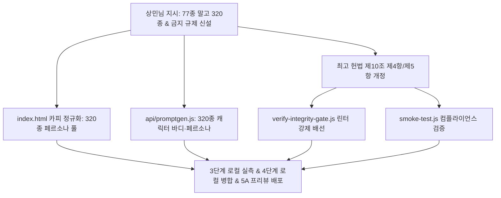

# 작업계획서 (PLAN) — 아바타 페르소나 사용자 노출 '77종' 전면 배제·'320종' 단일화 및 영구 금지 헌법 규제 구축

> **문서 ID**: PLAN-TASK-ES-167-avatar-320-persona-rule  
> **티켓 연계**: #TASK-ES-167  
> **작성 일시**: 2026-09-17  
> **작성자**: Antigravity (세션 4a66ddc5)  
> **규범 준수**: [OURGOAL_ABSOLUTE_INTEGRITY_RULES](file:///C:/dev/ourgoal-app/docs/rules/OURGOAL_ABSOLUTE_INTEGRITY_RULES.md) 준수 (헌법 제2조 2중 8원칙 엄수)

---

## 1. [원칙 ①] 엔지니어링 아키텍처 및 변경 범위 파악
- **REQ 핵심 요약**:
  - `index.html` 내 가이드 허브 아바타 설명 카피의 '77종'을 '320종'으로 교체.
  - `api/promptgen.js` 내 Gemini 비전 인스트럭션 '77종'을 '320종'으로 교체.
  - `OURGOAL_ABSOLUTE_INTEGRITY_RULES.md` 및 `C:\Users\HP\AGENTS.md` 제10조에 '77종 노출 금지 및 320종 단일화' 조항 신설.
  - `scripts/verify-integrity-gate.js`에 정적 검출 방화벽 배선.
  - `scripts/smoke-test.js`에 헌법 컴플라이언스 검증 추가.
  - PWA 캐시 갱신 (`ourgoal-shell-v20260917-es167`).
- **영향받는 파일 목록**:
  - `index.html` (수정 1줄)
  - `api/promptgen.js` (수정 1줄)
  - `docs/rules/OURGOAL_ABSOLUTE_INTEGRITY_RULES.md` (수정 약 15줄)
  - `C:\Users\HP\AGENTS.md` (수정 약 15줄)
  - `scripts/verify-integrity-gate.js` (수정 약 25줄)
  - `scripts/smoke-test.js` (수정 약 20줄)
  - `sw.js` (수정 2줄)
  - `docs/rules/TICKETS.md` (수정 2줄)

---

## 2. [원칙 ②] 본질 · 원인 · 중심 · 핵심 배선 (Wire) 식별
- **[본질] (Essence)**: 아바타 페르소나 체계의 정체성을 320종으로 완전 일치시키고, 과거 파편화된 표현(77종)의 재발을 물리적으로 원천 봉쇄하는 최고 규범화.
- **[원인] (Root Causes - 기저 원인 3가지)**:
  1. 가이드 텍스트 작성 시 과거 #TASK-ES-046/047 시절의 카탈로그 수치(77종)를 레거시 기억에서 단순 복사함.
  2. #TASK-ES-122/127의 사용자 노출 카피 제거 지시에도 불구하고 기계적 방화벽(Linter)이 부재했음.
  3. 최고 헌법 제10조(용어 헌법)에 명문화되지 않았음.
- **[중심] (Core Bottleneck & Wire)**: UI 카피 100% 정규화 및 `verify-integrity-gate.js` 내 기계적 린터 배선.
- **[핵심] (Critical Anchor)**: 레거시 하위 호환성(`BODY_THEMES_77`)은 온전히 보존하면서 사용자 노출 및 AI 인스트럭션에서 77종을 영구 배제하는 안전한 경계선 분리.

---

## 3. [원칙 ③] 효과적 해결방식 및 파일별 변경 예산 (Diff Budget)
- **Diff 예산**:
  - `index.html`: +1줄, -1줄
  - `api/promptgen.js`: +1줄, -1줄
  - `docs/rules/OURGOAL_ABSOLUTE_INTEGRITY_RULES.md`: +15줄
  - `C:\Users\HP\AGENTS.md`: +15줄
  - `scripts/verify-integrity-gate.js`: +25줄
  - `scripts/smoke-test.js`: +20줄
  - `sw.js`: +1줄, -1줄
  - `docs/rules/TICKETS.md`: +1줄

---

## 4. [원칙 ④] 1~3 재검토 및 기존 기능 불파괴 보증
- **유저 데이터 100% 보존**: 프로필, 보관함, 기존 생성 아바타는 변경되지 않음.
- **호환성 보존**: `BODY_THEMES_77` 배열 및 관련 77종 테마 ID(1~77)는 레거시 호환 레이어로 온전히 유지.
- **화면 및 스타일 보존**: CSS 및 레이아웃 변경 없음.

---

## 5. [원칙 ⑤] 구현 상세 순서 (Step-by-Step Sequence)
1. `docs/rules/TICKETS.md`에 #TASK-ES-167 등록.
2. `index.html` 가이드 허브 아바타 카피 수정 (3256행).
3. `api/promptgen.js` 시스템 프롬프트 수정 (170행).
4. `docs/rules/OURGOAL_ABSOLUTE_INTEGRITY_RULES.md` 및 `C:\Users\HP\AGENTS.md` 제10조 개정.
5. `scripts/verify-integrity-gate.js` 용어 헌법 린터 추가.
6. `scripts/smoke-test.js` 컴플라이언스 테스트 추가.
7. `sw.js` PWA 캐시 버전 최신화.
8. 자동화 테스트 실행 (`node scripts/smoke-test.js`, `node scripts/verify-integrity-gate.js`).
9. Headless Chrome CDP 로컬 실측 및 스크린샷 증거 확보.
10. 로컬 main 병합 및 Vercel 프리뷰 배포 (5A).

---

## 6. [원칙 ⑥] 절차 재검증: 5대 무결성 검증 시나리오 설계
- **검증 A (Dead Click 0)**: 가이드 허브 아바타 탭 내 버튼 클릭 무결성 유지.
- **검증 B (Data Loss 0)**: 10종 가상 페르소나 데이터 무손실 검증.
- **검증 C (UX Regression 0)**: 6개 탭 가이드 허브 화면 렌더링 회귀 0건.
- **검증 D (Cross-View Wire)**: 아바타 모달 직결 연동 유지.
- **검증 E (Gatekeeper)**: `verify-integrity-gate.js` 17개 이상 전 항목 ALL PASS.

---

## 7. [원칙 ⑦] 단계별 실행 체크리스트 (헌법 제9조 제3항 준수)
- [ ] **[1단계: 기획·설계 상태]**: REQ/PLAN 및 작업계획서 수립, TICKETS.md 등록.
- [ ] **[2단계: 내부 시뮬레이션 상태]**: 코드 수정, 헌법 개정, 린터 배선, 테스트 통과.
- [ ] **[3단계: 로컬 수동 확인 상태]**: Chrome CDP 로컬 렌더링 실측 및 스크린샷 증거 확보.
- [ ] **[4단계: 로컬 메인 병합 상태]**: feature 브랜치를 로컬 main에 병합 (정상 마감점).
- [ ] **[5A단계: Vercel 프리뷰 배포]**: Vercel 임시 프리뷰 배포 자동 실행 및 URL 제공.

---

## 8. [원칙 ⑧] 막히는 지점 예상 및 롤백 계획
- **잠재 오류**: `verify-integrity-gate.js` 린터가 코드 내부의 레거시 식별자를 오탐하여 빌드를 차단하는 현상.
- **대응책**: 정규식에 파일 단위 및 주석/식별자 화이트리스트를 엄격히 지정하여 순수 사용자 노출 텍스트만 차단.
- **롤백 절차**: 문제 발생 시 `git checkout .`으로 안전 롤백.
