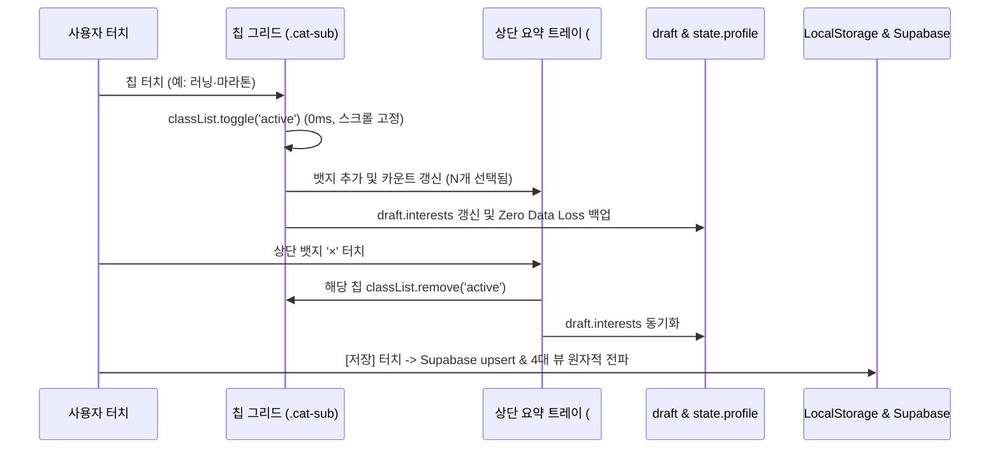

# [구현 계획서] #TASK-ES-325: [74] 프로필 편집 관심 카테고리(Interests) 선택 및 저장 작동 안함 오류 수정 및 아워골 본질 기반 UX 혁신

- **작성일**: 2026-09-27
- **담당자**: 양상민 님 & Gemini / Antigravity
- **상태**: 구현 중
- **티켓**: `#TASK-ES-325` (UI/UX 개선 / 프로필 편집 / P1)
- **노션 생각 메모장**: [74]번
- **브랜치**: `feat/2026-09-27-task-es-325-profile-edit-interests-fix`

---

## 1. 엔지니어링 아키텍처 및 변경 범위 파악
- **영향받는 파일**:
  1. `ui.css`: `.cat-sub-grid`, `.cat-sub`(44px), 요약 트레이, 대분류 점프 탭 스타일 추가
  2. `index.html`: `paintInterests` 인-플레이스 토글 리팩토링, 상단 요약 트레이, 대분류 탭, 목표 연동 배너 추가, `loadProfile`/`saveProfile`의 `Array.isArray` 개편
  3. `js/components.js`: `handle프로필_Item74Action` 배선
  4. `tests/profile-interests-fix.test.js`: 신규 단위 테스트
  5. `scripts/smoke-test.js`: 스모크 테스트 항목 추가
  6. `docs/rules/TICKETS.md`: 티켓 상태 등록

---

## 2. 본질 · 중심 배선(Wire) 식별

---

## 3. 효과적 해결방식 및 파일별 변경 예산 (Diff Budget)
- `ui.css`: 약 +40줄 (CSS 전용 클래스 추가, 기존 스타일 파괴 없음)
- `index.html`: 약 +80줄 / -30줄 (기존 innerHTML 파괴 제거, 인-플레이스 토글 및 상단 트레이 로직 추가)
- `js/components.js`: 약 +80줄 (`handle프로필_Item74Action` 직통 핸들러 신설)
- `tests/profile-interests-fix.test.js`: 약 +120줄 (단위 테스트 신설)
- `scripts/smoke-test.js`: 약 +30줄 (회귀 방지 스모크 테스트 추가)

---

## 4. 1~3 재검토 및 기존 기능 불파괴 보증
- 기존 프로필 편집 기능(닉네임, 소개글, 아바타 320종 변경, 잇템 추가, 지역 설정)은 100% 온전하게 보존.
- 기존 카테고리 상수(`TOPICS`) 및 키 포맷(`major/sub`) 구조를 그대로 유지하여 기존 데이터와의 완벽한 하위 호환성 유지.

---

## 5. 구현 상세 순서 (Step-by-Step Sequence)
1. **Step 1 [CSS 규격화]**: `ui.css`에 `.cat-sub-grid`, `.cat-sub` 44px, 요약 트레이, 대분류 탭 스타일 정의.
2. **Step 2 [인-플레이스 토글 및 UX 혁신]**: `index.html` 내 `openProfileEditor` 리팩토링:
   - 상단 선택 요약 트레이(`pvSelectedTray`) DOM 및 동기화 함수
   - 목표 기반 1초 가져오기 배너(`pvSmartGoalSyncBanner`)
   - 6대 대분류 퀵 앵커 탭(`pvMajorAnchorBar`)
   - `paintInterests` 1회 빌드 + 이벤트 위임 인-플레이스 토글
3. **Step 3 [영속성 무결성 개편]**: `index.html` 내 `loadProfile()` 및 `saveProfile()`에서 `urow.interests.length` Falsy 결함을 `Array.isArray`로 교체.
4. **Step 4 [직통 핸들러 배선]**: `js/components.js`에 `handle프로필_Item74Action` 구현 및 전역 노출.
5. **Step 5 [단위/스모크/CDP 검증]**: 테스트 실행 및 모바일 375px 실측 캡처.
6. **Step 6 [법정 심사 및 Tri-Sync]**: 초안 PR 제출, court 판정 수신, 노션 완료 PATCH, 관제센터 체크.

---

## 6. 절차 재검증: 법정 주장(claims) 설계
- 표준 검증: 구문 분석, 375px 레이아웃, 클릭 가능 여부.
- 청구 시나리오:
  1. 프로필 편집 모달에서 관심사 칩 탭 시 `active` 클래스 즉각 반전 확인.
  2. 스크롤 위치 이동 없이 상단 요약 트레이에 뱃지 반영 확인.
  3. 0개 해제 후 저장 시 `state.profile.interests`가 빈 배열로 정상 영속화되는지 확인.
  4. `handle프로필_Item74Action` 실행 시 로컬 캐시 및 4위 1체 동작 확인.

---

## 7. 단계별 실행 체크리스트
- [ ] `ui.css` 스타일 추가
- [ ] `index.html` 인-플레이스 토글 및 상단 요약 트레이 구현
- [ ] `index.html` `Array.isArray` 영속화 수정
- [ ] `js/components.js` 직통 핸들러 구현
- [ ] 단위 테스트 작성 및 전수 통과
- [ ] 스모크 테스트 433+ 전수 통과
- [ ] CDP 375px 모바일 캡처 검증
- [ ] `claims.json` 작성 및 court 검증
- [ ] Git commit, push, PR 생성

---

## 8. 막히는 지점 예상 및 롤백 계획
- 만약 모바일에서 앵커 스크롤 동작이 부드럽지 않은 구형 기기가 있을 경우, `behavior: 'smooth'`에 `try-catch`를 적용하여 안전하게 폴백.
- 문제 발생 시 즉시 `git checkout`으로 원상복구 가능한 단일 브랜치 격리 구조 유지.
