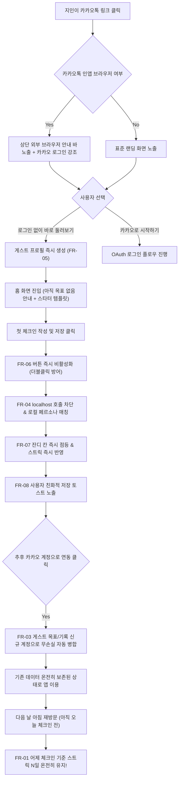

# 요구사항 정의서 (REQ) — 지인 배포 대비 9대 UX 핵심 결함 전수 해결 및 사용자 여정 최적화

**문서 ID**: REQ-PRE-RELEASE-UX-REFINEMENT  
**티켓 연계**: #TASK-ES-043 (지인 배포 대비 9대 UX 핵심 결함 해결 및 세션 무결성)  
**작성 일시**: 2026-09-13 (배포 D-6시간 전)  
**우선순위**: P0 (쇼스토퍼 4건) + P1 (사용자 경험 개선 5건)  
**관련 문서**: [AUDIT-2026-09-13-PRE-RELEASE](file:///C:/dev/ourgoal-app/docs/audit/2026-09-13-pre-release-ux-audit.md)  

---

## 1. 개요 및 배경

아워골 앱을 지인들에게 배포하기 6시간 전, 신규 사용자가 앱 링크를 수신하여 진입하고, 목표를 둘러보고, 첫 체크인을 기록하고, 나중에 재방문하는 **전체 생애주기(FTUE to Retention)**에서 발생하는 마찰점을 전수 점검했습니다.  
점검 결과, 사용자의 성취감을 파괴하는 **스트릭 0일 리셋 버그**, 개인정보 노출 위험인 **상민님 개인 이메일 노출**, 가입 시 기존 데이터를 날려버리는 **게스트 세션 유실**, 그리고 **HTTPS 환경 localhost:7777 호출 차단** 등 4대 치명적 쇼스토퍼가 확인되었습니다.  
본 요구사항 정의서는 지인 배포 전 9대 결함을 완벽하게 해소하여, 무마찰 첫 진입부터 신뢰할 수 있는 데이터 시각화까지 보장하는 것을 목표로 합니다.

---

## 2. 본질 축 및 체감 가설

### 2-1. 본질 축 (Essence Axis)
- **E1 (체크인 루프)**: 묻기 → 답하기 → 피드백 → 내 위치 확인 → 기록. 성취감이 동력.
- **E2 (기록 회고)**: 기록을 확인하면서 성취감과 신뢰를 느끼고, 기록의 가치를 체감.
- **FIX / INFRA**: 데이터 유실 방지, 세션 안전 이관, 보안 및 런타임 안정성 보장.

### 2-2. 체감 가설 (User Experience Hypothesis)
> *"지인이 카카오톡으로 전달받은 링크를 눌렀을 때, 번거로운 회원가입 절차 없이 1초 만에 앱의 핵심 가치를 체험하고, 오늘 체크인을 작성했을 때 잔디와 배지가 즉시 켜지며, 다음 날 아침에 다시 들어와도 어제까지의 연속 달성 기록(스트릭)이 0일로 리셋되지 않고 온전히 유지되는 것을 보며 신뢰감과 성취감을 얻고 앱을 계속 쓰게 된다."*

---

## 3. 기능 요구사항 상세 (FR-01 ~ FR-09)

### [P0 쇼스토퍼 4대 요구사항]

#### FR-01: 당일 미체크인 시 스트릭(연속 달성일) 보존 및 정확한 역산 알고리즘
- **식별자**: FR-01 (우선순위: P0, 본질: E1/E2)
- **문제점**: `computeStreakDays()`가 무조건 오늘(`new Date()`)부터 체크인 여부를 역산함. 오늘 아직 체크인을 안 한 아침 9시에 앱을 켜면 `days[오늘]`이 false가 되어 루프가 즉시 종료되고 `streak = 0`이 반환됨. (어제까지 14일 연속 체크인한 유저도 0일로 보임).
- **상세 요구사항**:
  1. 오늘 체크인 기록이 있으면 오늘부터 역산하여 N일을 계산한다.
  2. 오늘 체크인 기록이 없더라도, **어제 체크인 기록(또는 어제 스트릭 프리즈 사용 기록)이 존재하면 어제부터 역산하여 N일을 온전히 유지**하여 반환한다.
  3. 어제도 체크인하지 않고 프리즈도 없다면 스트릭은 0일로 계산된다.
  4. 화면 문구와 배지는 스트릭 N일을 유지하되, 홈 화면 및 스트릭 배지에 *"오늘 체크인하면 N+1일 연속!"* 또는 *"🔥 N일 유지 중"*임을 자연스럽게 인지시킨다.

#### FR-02: 설정 화면 계정 이메일 상민님 개인 이메일(`ysm0422@naver.com`) 하드코딩 원천 제거
- **식별자**: FR-02 (우선순위: P0, 본질: INFRA/보안)
- **문제점**: `emailEl.textContent` 바인딩 시 폴백 문자열로 `ysm0422@naver.com`이 하드코딩되어 있어, 게스트나 이메일이 없는 카카오 유저에게 상민님의 개인 네이버 이메일이 내 계정인 것처럼 표시됨.
- **상세 요구사항**:
  1. 사용자 세션 또는 프로필에 유효한 이메일이 존재하면 해당 이메일을 마스킹/표시한다.
  2. 게스트 모드 사용자(`state.profile.id`가 `guest-`로 시작하거나 `isGuest`인 경우)는 `'게스트 모드 (로그인 후 계정 연동)'`으로 표시한다.
  3. 로그인 계정이나 이메일 정보가 없는 경우 `'연동된 이메일 없음'`으로 안전하게 표시한다.
  4. 개인정보 노출 위험을 원천 차단한다.

#### FR-03: 게스트 모드 작성 데이터의 소셜 로그인(카카오/구글) 전환 시 무손실 자동 병합 (Merge)
- **식별자**: FR-03 (우선순위: P0, 본질: E1/E2/INFRA)
- **문제점**: 게스트 상태에서 목표를 만들고 체크인을 작성한 뒤 소셜 로그인을 진행하면 새 계정 DB를 불러오면서 기존 로컬 게스트 데이터가 덮어써져 화면에서 증발함.
- **상세 요구사항**:
  1. `restoreSessionAndEnter(session)` 호출 시, 로컬에 기존 `ourgoal_guest_profile`이 존재하고 목표(`goals.length > 0`) 또는 기록(`records.length > 0`)이 있는지 검사한다.
  2. 기존 게스트 데이터가 확인되면, 신규 로그인 사용자 ID(`session.user.id`)로 목표의 `user_id`와 체크인의 `user_id`를 재할당하여 Supabase DB에 `upsert` 병합한다.
  3. 병합 완료 후 `state.profile`에 기존 게스트 목표와 기록이 온전히 포함되도록 합본을 구성하고 로컬 백업을 갱신한다.
  4. 병합이 성공적으로 완료되면 임시 `ourgoal_guest_profile`을 안전하게 소거한다.
  5. 사용자에게 *"게스트 모드에서 작성한 목표와 기록을 안전하게 계정으로 가져왔어요!"* 토스트 피드백을 제공한다.

#### FR-04: 첫 체크인 시 `http://localhost:7777` 호출 차단 및 배포 환경 로컬 폴백 가드
- **식별자**: FR-04 (우선순위: P0, 본질: INFRA/안정성)
- **문제점**: `triggerFirstCheerResponse`에서 커맨드센터 HUD 포트(`http://localhost:7777`)로 HTTP fetch를 전송하여, HTTPS Vercel 배포 환경에서 브라우저 보안 정책상 Mixed Content 차단 및 콘솔 에러를 발생시킴.
- **상세 요구사항**:
  1. `window.location.hostname`이 `localhost` 또는 `127.0.0.1`인 로컬 개발 환경에서만 `http://localhost:7777` 호출을 시도한다.
  2. 운영 도메인(`*.vercel.app`, `ourgoal.kr` 등) 환경에서는 외부 호출을 즉시 건너뛰고 내부 로컬 페르소나 매칭 폴백(`SIM_PERSONAS`)을 0ms 딜레이 없이 실행한다.
  3. 콘솔에 불필요한 네트워크 에러나 보안 경고가 찍히지 않도록 완벽히 방어한다.

---

### [P1 사용자 경험 개선 5대 요구사항]

#### FR-05: 메인 랜딩 화면 내 '로그인 없이 바로 둘러보기' 게스트 입장 CTA 신설
- **식별자**: FR-05 (우선순위: P1, 본질: E1/FTUE)
- **상세 요구사항**:
  1. `landingScreen`의 소셜 로그인 버튼 하단에 `[로그인 없이 바로 둘러보기]` (텍스트 링크 또는 고스트 버튼)를 명확히 배치한다.
  2. 클릭 시 고유 게스트 ID(`guest-` + random)를 발급하고, `defaultProfile`을 생성하여 로컬스토리지에 저장한 뒤 즉시 `enterApp()`을 호출한다.
  3. 지인이 가입 절차 없이 1초 만에 홈 화면에 진입하여 목표 추천과 체크인 작성을 체험할 수 있도록 초기 마찰을 제로화한다.

#### FR-06: 체크인 저장(`captureSave`) 및 목표 생성 버튼 더블클릭/연타 방어 (`isSubmitting`)
- **식별자**: FR-06 (우선순위: P1, 본질: E1/안정성)
- **상세 요구사항**:
  1. 홈 화면 `captureSave` 버튼 클릭 시 즉시 `saveBtn.disabled = true` 및 `pointer-events: none`을 적용한다.
  2. 버튼 텍스트를 `'기록 중…'`으로 변경하고 로딩 인디케이터를 표시한다.
  3. 프로필 저장 및 AI 피드백 호출이 완료되거나 에러 발생 시 버튼을 원래 상태로 복구(`saveBtn.disabled = false`, 텍스트 복원)한다.
  4. 목표 추가 모달의 저장 버튼(`modalTgSaveBtn`, `addGoalBtn`)에도 동일한 비활성화 가드를 적용하여 데이터 중복 생성을 원천 방지한다.

#### FR-07: 체크인 완료 직후 홈 화면 잔디 요약(`renderHomeGrassSummary()`) 및 스트릭 배지 즉시 리렌더링
- **식별자**: FR-07 (우선순위: P1, 본질: E1/반응성)
- **상세 요구사항**:
  1. `captureSave` 핸들러가 성공적으로 체크인을 기록한 직후, `renderHomeGrassSummary()`와 스트릭 배지 업데이트(`badgeEl.innerHTML = streakBadgeHtml(computeStreakDays())`)를 즉각 호출한다.
  2. 사용자가 다른 탭을 이동하지 않더라도 오늘 날짜 잔디 칸에 초록색 불이 즉시 들어오고 스트릭 카운트가 즉각 반응하도록 보장한다.

#### FR-08: 체크인 완료 토스트 내 'AI 노션 DB' 내부 개발/도구 언어 제거 (금지 4-3 준수)
- **식별자**: FR-08 (우선순위: P1, 본질: E1/규범 준수)
- **상세 요구사항**:
  1. 체크인 저장 후 발생하는 토스트 문구에서 `AI 노션 DB로 자동 기록 완료! (완료 · 5km)` 등의 내부 도구 언어를 전면 제거한다.
  2. 사용자 친화적 언어로 대체한다:
     - 일반 기록: `'오늘의 기록이 안전하게 저장되었어요'`
     - 사진 포함: `'사진과 함께 소중한 오늘을 기록했어요'`
     - 스트릭 프리즈 획득: `'스트릭 프리즈 획득! 하루를 놓쳐도 연속 기록이 지켜져요'`

#### FR-09: 카카오톡 인앱 브라우저 감지 시 사파리/크롬 외부 브라우저 열기 안내
- **식별자**: FR-09 (우선순위: P1, 본질: INFRA/호환성)
- **상세 요구사항**:
  1. `navigator.userAgent`를 검사하여 카카오톡 인앱 웹뷰(`KAKAOTALK`) 환경인지 판별한다.
  2. 카카오톡 웹뷰 환경일 경우:
     - 랜딩 화면 상단에 작은 안내 바를 노출한다: *"카카오톡 안에서는 Google 로그인이 제한될 수 있어요. 카카오로 시작하시거나 우측 상단 [⋮] → [다른 브라우저로 열기]를 눌러주세요."*
     - 카카오 로그인 버튼을 가장 상단에 굵게 강조하여 안내한다.

---

## 4. UI/UX 흐름 및 상태 천이도



---

## 5. 데이터 모델 및 마이그레이션 스키마

### 5-1. 게스트 데이터 병합 매핑 규칙
```javascript
// 게스트 -> 소셜 유저 병합 페이로드 규격
{
  targetUserId: session.user.id,
  goalsToMigrate: (guestProfile.goals || []).map(g => ({
    ...g,
    user_id: session.user.id,
    updated_at: nowISO()
  })),
  checkinsToMigrate: (guestProfile.records || []).map(r => ({
    ...r,
    user_id: session.user.id,
    updated_at: nowISO()
  }))
}
```

### 5-2. 스트릭 계산 모델 명세
| 상태 | 어제 체크인 여부 | 오늘 체크인 여부 | 스트릭 계산 결과 | 안내 텍스트 |
| :---: | :---: | :---: | :---: | :--- |
| **케이스 A** | O | O | **N일** | `🔥 N일 연속 달성!` |
| **케이스 B** | O | X (아직 안 함) | **N일 (유지)** | `🔥 N일 연속 유지 중 (오늘 체크인 시 N+1일)` |
| **케이스 C** | X | O | **1일** | `🌱 1일차 시작!` |
| **케이스 D** | X | X | **0일** | `스트릭을 시작해보세요` |

---

## 6. 엣지케이스 및 예외 처리 매트릭스

| 번호 | 상황 | 잠재적 오류 | 방어 메커니즘 |
| :---: | :--- | :--- | :--- |
| **EC-01** | 네트워크 단절 상태에서 체크인 | 데이터 증발 | `OfflineSyncManager.enqueue` 로컬 큐 적재 후 온라인 복구 시 자동 동기화 |
| **EC-02** | 게스트 병합 중 Supabase 일시 지연 | 병합 실패 및 데이터 유실 | 로컬 백업(`ourgoal_goals_backup_`, `ourgoal_records_backup_`)에 보존 후 백그라운드 재시도 |
| **EC-03** | 자정 직전(23:59)과 직후(00:01) 체크인 | 타임존 불일치 | 브라우저 로컬 타임존 기반 날짜 키(`dateKey`)를 일관되게 적용하여 KST 기준 정확 분기 |
| **EC-04** | 빠른 3회 연속 터치 | 중복 레코드 적재 | `isSubmitting` 플래그 및 `btn.disabled = true`로 첫 터치 이후 즉시 차단 |

---

## 7. 인수 기준 (Acceptance Criteria)

- [ ] **AC-01 (스트릭 유지)**: 어제 체크인 기록이 있는 상태에서 오늘 체크인을 하지 않고 앱을 열었을 때, `computeStreakDays()`가 `0`이 아닌 어제까지의 연속 일수(N일)를 반환해야 한다.
- [ ] **AC-02 (개인 이메일 차단)**: 게스트 상태로 설정 화면 진입 시, `ysm0422@naver.com`이 절대 노출되지 않고 `'게스트 모드 (로그인 후 계정 연동)'`으로 표시되어야 한다.
- [ ] **AC-03 (게스트 병합)**: 게스트 모드에서 목표 1개와 체크인 1개를 작성한 후 소셜 로그인 완료 시, 해당 목표와 체크인이 새 계정 화면에 그대로 유지되어야 한다.
- [ ] **AC-04 (localhost 차단)**: 운영 도메인에서 첫 체크인을 실행했을 때 콘솔에 `ERR_CONNECTION_REFUSED` 또는 `localhost:7777` 관련 에러가 0건이어야 한다.
- [ ] **AC-05 (랜딩 둘러보기)**: 랜딩 화면에 `[로그인 없이 바로 둘러보기]` 버튼이 존재하며, 클릭 시 즉시 홈 화면으로 진입해야 한다.
- [ ] **AC-06 (연타 방지)**: 체크인 저장 버튼을 연속 클릭해도 `checkin` 레코드가 단 1건만 생성되어야 한다.
- [ ] **AC-07 (잔디 즉시 반응)**: 체크인 저장 버튼 클릭 직후, 다른 탭 이동 없이 홈 화면 잔디 요약 칸이 즉시 갱신되어야 한다.
- [ ] **AC-08 (도구 언어 제거)**: 체크인 완료 토스트에 `'노션 DB'`라는 단어가 일체 포함되지 않아야 한다.
- [ ] **AC-09 (규범 준수)**: `npm test` 스모크 테스트 100% 통과 및 `index.html` 순증가 300줄 이내를 준수해야 한다.
