# 🏛️ 아워골(OurGoal) 지식기반 완결 압축본 15장
> **아워골 최고 헌법(The 15 Supreme Articles) · 총괄 지식기반(Obsidian/Notion/Command Center) · 비즈니스 및 실행 로드맵 완전 통합 정본**  
> **버전**: `2026.09.21-SUPREME-15-ARTICLES-VERDICT-SEPARATION` 기반 통합 압축본  
> **기준 위계**: `[조(Article) ➔ 항(Paragraph) ➔ 호(Item) ➔ 목(Sub-item)]` 단일 법체계 준수

---

## 📌 [총괄 목차] 아워골 지식기반 15장 체계

```mermaid
flowchart TD
    subgraph Core_Philosophy ["제1부: 철학과 비전 (제1장 ~ 제2장)"]
        CH1["제1장: 존재 이유와 3대 본질 루프 (철학·목적·5대 축·6대 고질병)"]
        CH2["제2장: 사업 기획과 비즈니스 모델 (사업제안서·수익화 4대 규범·200대 모델)"]
    end

    subgraph Roadmap_Spec ["제2부: 로드맵과 기획 체계 (제3장 ~ 제4장)"]
        CH3["제3장: 실행 로드맵과 성장 전략 (D0~D122 로드맵 239건·성장 백로그 95선)"]
        CH4["제4장: 문제해결 2중 8원칙과 기획·감찰 규격 (REQ·PLAN·핫픽스·4차원 매트릭스)"]
    end

    subgraph UIUX_Integrity ["제3부: UI/UX 및 배선 무결성 (제5장 ~ 제6장)"]
        CH5["제5장: 핵심 기능 카탈로그와 4대 메인 뷰 UI/UX (60선 템플릿·집중 성소)"]
        CH6["제6장: 껍데기 UI 박멸 및 4위 1체 완전 배선 (AI 축약 금지·CSS 은폐 금지·여정 완결)"]
    end

    subgraph Rules_Governance ["제4부: 절대 규범과 개발 거버넌스 (제7장 ~ 제9장)"]
        CH7["제7장: 절대 금지 9대 행위 및 디자인 규격 (위조 지표 0·파괴 삭제 금지·토큰 계승)"]
        CH8["제8장: 승인선 통제와 코드 무결성 자율 확장 (5대 필수 승인선·품질 절대주의)"]
        CH9["제9장: 1티켓 1PR 작업 체계와 결심 가시성 (4블록 PR·모바일 Reviewer 배정)"]
    end

    subgraph Verification_Ops ["제5부: 법정 검증과 배포 안전망 (제10장 ~ 제12장)"]
        CH10["제10장: 7대 무결성 전수 검증과 법정(Court) 단일 판정 (3중 방화벽·별표2·별표3)"]
        CH11["제11장: 직관적 6단계 작업 상태와 판정서 보고 (상태 측정·닫힌 사유 9종)"]
        CH12["제12장: 배포 안전핀과 단일 배포 파이프라인 (4단계 마감·자동 프리뷰·Vercel 통제)"]
    end

    subgraph Network_Data ["제6부: 소셜 네트워크와 데이터 영속성 (제13장 ~ 제15장)"]
        CH13["제13장: 14인 AI 에이전트 조직과 자동화공장 (상민클론·컨트롤타워·6대 SOP)"]
        CH14["제14장: 실 사용자 계정 상호 연동 및 모바일 E2E (E3 백본·실시간 생존성·하드웨어)"]
        CH15["제15장: Tri-Sync 3자 상호 동기화와 유저 자산 영속성 (Notion-Obsidian-HUD·스마트 스토리지)"]
    end

    Core_Philosophy --> Roadmap_Spec
    Roadmap_Spec --> UIUX_Integrity
    UIUX_Integrity --> Rules_Governance
    Rules_Governance --> Verification_Ops
    Verification_Ops --> Network_Data
```



---

## 제1장: 존재 이유와 3대 본질 루프 (철학 · 목적 · 5대 축 · 6대 고질병)
> **헌법적 근거**: `제1조 (3대 본질 루프 및 인프라 헌법)` / `ESSENCE_OURGOAL.md`

### 1.1 헌법의 궁극 목적: 실존적 불안 해소 및 무공해 성장 도피처
* **보편적 삶의 불안 치유**: "내가 제대로 잘 살고 있는 게 맞나? 앞으로 어떻게 나아가야 하지?"라는 현대인의 실존적 불안을 실질적인 기록과 체감으로 해소.
* **무공해 도피처 선언**: 도파민 유도성 쓰레기 알고리즘, 자극적인 숏폼, 타인과의 비교로 인한 상대적 박탈감(인스타그램 피로증)으로부터 완전히 격리된 순수한 자기성장 안식처 제공.

### 1.2 3대 철학 심사 기준
1. **무공해성 (Anti-Pollution)**: 도파민이나 과시를 조장하지 않고, 뇌의 피로를 씻어내는 담백한 쉼터인가?
2. **RPG식 체감 (Immediate Self-Efficacy)**: 실천이 인생 청사진과 직결되어 즉각적인 효능감(경험치 획득 체감)을 주는가?
3. **동류 연대 (Peer Accompaniment)**: 경쟁과 질투가 아닌, 같은 고민을 안고 나아가는 동료와의 무공해 연대감을 주는가?

### 1.3 3대 본질 루프 및 5대 축 귀속 의무
모든 개발 및 기획 작업은 반드시 아래 5대 축 중 하나에 명시적으로 귀속되어야 합니다:
* **E1 (체크인 루프)**: 목표 실천, 체크인, 스트릭 유지. 단순 투두 체크박스가 아닌 인생 목표와 연결되는 RPG 퀘스트 즉각 보상 체감.
* **E2 (기록 회고 루프)**: 5단위(오늘·주·월·년·설정기간) 회고와 AI 피드백을 통해 자기효능감을 복원하고 다음 기록 의지 형성.
* **E3 (동류 소통 루프)**: 동반자 맺기, 1:1 대화, 팀 목표, 응원 피드. 박탈감 없는 동류와의 무공해 연대.
* **INFRA (기반 인프라)**: PWA, 인증, Supabase DB 마이그레이션, 성능, CI/CD, Tri-Sync.
* **FIX (버그 수정)**: 회귀 결함 복구, UI 깨짐 수습, 무결성 보완.

### 1.4 6대 핵심 고질병 원천 근절 선언
| 고질병 명칭 | 결함 실태 및 금지 규정 | 근절 장치 |
|---|---|---|
| **1호 되던 기능 먹통 (Regression)** | 새 코드 배포 후 기존 정상 기능이 깨지는 현상 전면 차단 | 법정(Court) 기준 시험지 채점 |
| **2호 껍데기 버튼 방치 (Shell UI)** | HTML 마크업만 있고 실제 리스너/핸들러가 없는 가짜 버튼 박멸 | 4위 1체 배선 및 정적 린터 |
| **3호 상호연계 고립 (Disconnection)**| 기능이 단독으로만 겉돌고 연관 화면과 상호작용하지 못하는 현상 금지 | 4대 뷰 동시 전파 배선 |
| **4호 유저 데이터 증발 (Data Loss)** | 업데이트·로그인 전환 시 아바타·목표·기록 1바이트라도 유실되는 것 절대 금지 | Server-First 및 합집합 병합 |
| **5호 화면 간 상태 불일치 (Desync)** | 한 화면에서 변경된 데이터가 타 화면에 즉시 반영되지 않는 현상 차단 | `state` 단일 진실 공급원(SSOT) |
| **6호 가짜 실제구현 (Fake Impl)** | 실 계정 연동 없이 `setTimeout` 가상 봇, 로컬스토리지 자가순환으로 눈속임하는 행위 영구 금지 | 실 계정 물리 E2E 연동 강제 |

---

## 제2장: 사업 기획과 비즈니스 모델 (사업제안서 · 수익화 4대 규범 · 200대 모델)
> **헌법적 근거**: `제5조 제1항 제1호` / `아워골_사업제안서_정본.md` / `MOC_아워골_수익화모델_200.md`

### 2.1 사업 개요 및 PSST 프레임워크 요약
* **서비스 정의**: 고립된 작심삼일을 끝내는 AI 지능형 페이스메이커 & 무공해 소셜 넛지 플랫폼.
* **핵심 타깃**: 갓생을 지향하지만 고립된 의지력 한계와 SNS 피로감으로 30일 내 90% 이탈하는 2030 세대.
* **정부지원 및 IR**: 2027 예비창업패키지(최대 1억 원 무상지원금) 선정 및 시드/프리A 투자 유치 패키지(요약본 2P, 디테일본 60P 구비).

### 2.2 수익화 4대 규범 (Financial Integrity)
수익화 기능은 코어 루프(E1/E2/E3)를 인질로 잡지 않으며, 아래 4개 영역으로만 설계됩니다:
1. **아바타 다양화**: 서비스 본질 이용과 무관한 순수 자기만족·꾸미기 영역 과금 (기본 아바타로 모든 기능 100% 이용 가능).
2. **타 유저의 잇템**: 멘토나 동류의 프로필 확인 중 실질적 필요에 의해 스스로 원할 때만 결제하는 자발적 커머스.
3. **템플릿 복사 리워드 광고**: 타인의 우수한 루틴/목표 템플릿을 내 것으로 가져올 때 자발적으로 시청하는 윈-윈 구조.
   > [!IMPORTANT]
   > **서비스 런칭 초기 무광고 원칙**: 초기 유저 유입 및 안착을 위해 런칭 초기에는 일체의 광고를 전면 배제하며, 도입 시점은 상민님의 명시적 결심에 따릅니다.
4. **크리에이터 생태계 재투자**: 우수한 템플릿을 창작해 생태계에 기여한 유저에게 수익이 배분되는 선순환 보상 환경.

### 2.3 200대 수익화 모델 카탈로그 체계
* **카테고리 구성**: C2C 목표 템플릿 거래 마켓(수수료 15~20%), 프리미엄 AI 심층 피드백 구독(월 4,900~9,900원), 동류 크루 챌린지 예치금(성공 리워드형), 기업 복지 및 B2B 사내 목표 관리 연동 SaaS.

---

## 제3장: 실행 로드맵과 성장 전략 (D0~D122 로드맵 239건 · 성장 백로그 95선)
> **헌법적 근거**: `03_아워골_실행로드맵_및_성장백로그.md` / `MOC_아워골_일자별_실행로드맵_239.md`

### 3.1 D0~D122 마일스톤 5단계 (M0 ~ M4)
```
[M0: D0~D3]       [M1: D4~D30]      [M2: D31~D60]     [M3: D61~D90]     [M4: D91~D122]
PWA 웹앱 배포 ──> 초기 유저 5천명 ──> 3만명 달성 ───> 매출 5천만원 ───> 10만명 / 2억 달성
(MVP 안정화)      (체크인 루프 안착)  (PMF 40% 검증)    (4대 수익화 개방)  (월 30% 성장엔진)
```

* **M0 (D0~D3 / 기틀 마련)**: HTML/JS 단일 파일 구조에서 Supabase 실서버 스토리지 전환 및 PWA 홈화면 설치 가이드 배포.
* **M1 (D4~D30 / 코호트 안착)**: 지인 300명 코호트 검증 및 초기 유저 5,000명 유입. 체크인-회고-스트릭 루프 안정화.
* **M2 (D31~D60 / PMF 검증)**: 유저 30,000명 돌파, K-Factor(바이럴 계수) 1.2 달성, Sean Ellis PMF 지표 40% 이상 확보.
* **M3 (D61~D90 / 수익화 시동)**: 누적 매출 5,000만 원 돌파. 자발적 템플릿 마켓플레이스 및 잇템 커머스 결제 연동.
* **M4 (D91~D122 / 스케일업)**: 10만 활성 유저(MAU), 누적 매출 2억 원 달성, 구글 플레이/앱스토어 네이티브 앱 전환 완료.

### 3.2 성장 아이디어 백로그 95선 및 바이럴 장치
* **1-Tap 리퍼럴**: 가입 없이 목표 구조를 미리 열람하고 1초 만에 복사하는 링크(`_ref=`) 인입 엔진.
* **성취 내러티브 카드**: "기록이 만든 차이"를 인스타그램/스레드 규격 이미지로 1초 렌더링 내보내기.
* **동네 기반 오프라인 연계**: 동네 러닝·등산 크루 및 로컬 습관 클럽 O2O 확장.

---

## 제4장: 문제해결 2중 8원칙과 기획·감찰 규격 (REQ · PLAN · 핫픽스 · 4차원 매트릭스)
> **헌법적 근거**: `제2조 (2중 8원칙 및 핫픽스 헌법)`

### 4.1 문제해결 2중 8원칙 프로세스 (REQ ➔ PLAN)
코드를 작성하기 전, 반드시 문제해결 8원칙을 1회차(REQ)와 2회차(PLAN)로 2중 적용합니다:

```
[지시 접수] ──> [1회차: REQ 요구사항 정의서] ──> [2회차: PLAN 작업계획서] ──> [코드 구현]
                 (기획 및 본질 8원칙)               (엔지니어링 실행 8원칙)
```

| 원칙 번호 | 1회차: REQ 분석 기준 (`docs/specs/REQ-*.md`) | 2회차: PLAN 분석 기준 (`docs/specs/PLAN-*.md`) |
|:---:|---|---|
| **원칙 ①** | 지시 원문 가감 없이 수록, 기저 3층위 심층 분석 | 엔지니어링 아키텍처 파악 및 영향받는 파일 전수 목록 |
| **원칙 ②** | **4대 요소**: 본질(3대 철학)·원인·중심·핵심 분리 | 전역 상태(`state`) 영향 분석, 종단간 데이터 흐름도 |
| **원칙 ③** | 효과적 해결방식, 하지 말 것과 할 것 구분, 3대 명세 | 파일별 Diff 줄 수 예산(Budget), 4위 1체 배선 명세 |
| **원칙 ④** | 1~3 비판적 재검토, 맹점 인정, 엣지 케이스 점검 | 기존 기능 불파괴 검증, diff 방식 검증, 유저 자산 보존 |
| **원칙 ⑤** | 해결 순서, 데이터 흐름도, 4대 뷰 전파 시퀀스 | 구현 상세 순서 (모델 ➔ 로직 ➔ UI ➔ 리스너 ➔ 전파) |
| **원칙 ⑥** | **절차 재검증 (SPOF 분석, 누락 영구 금지)** | **법정 주장(claims) 설계 (측정 시나리오/확인수준)** |
| **원칙 ⑦** | 단계별 물리적·측정 가능한 완료 기준 명시 | 단계별 실행 체크리스트 (4단계 마감 상한 준수) |
| **원칙 ⑧** | 블로커 예상 및 1~7번 되돌아갈 재검증 트리거 | 잠재 기술 오류, 우회 로직, 무손실 롤백 파이프라인 |

### 4.2 기획 단계 스토리지 원장화 3대 명세 의무
REQ/PLAN 작성 시 원칙 ③에 아래 3대 항목이 누락되면 코드 작성이 전면 차단됩니다:
1. **원격 DB 스키마 명세**: Supabase 테이블명, 신설/변경 컬럼명, 타입 및 DDL 경로(`docs/sql/...`).
2. **스마트 스토리지 분기 설계**: 3계층(DB 영구 원장 / IndexedDB 캐시 / localStorage 메타) 저장 방식.
3. **4대 뷰 전파 배선도**: 변경 시 동시 호출될 렌더러 함수명(`renderHome`, `renderRecordsScreen` 등).

### 4.3 8원칙 기계적 무결성 규칙
* 원칙 번호 임의 합체(예: `원칙 ①, ②, ③`) 전면 금지 (8개 독립 `##` 섹션 강제).
* 원칙 ⑥(절차 재검증) 생략 영구 금지.
* 1줄 bullet point 날림 요식행위 금지 (`scripts/verify-integrity-gate.js` 자동 검사).

### 4.4 10줄 이하 핫픽스 패스트트랙 & 4차원 심층 매트릭스 감찰
* **핫픽스 요건**: 10줄 이하의 단순 오타, 마진/패딩 미세 조정, null 가드는 [문제-원인-수정-검증] 4줄 간이 서식으로 즉시 처리 (단, 인증/권한/결제 함수는 패스트트랙 절대 금지).
* **4차원 심층 감찰 매트릭스**: 결함 조사 지시 시 단발성 조사를 금지하고, **[전수 6대 탭 × 전수 모달/서브탭 × 전수 인터랙티브 요소 × 375px 뷰포트]**를 전수 스캐닝하여 보고.

---

## 제5장: 핵심 기능 카탈로그와 4대 메인 뷰 UI/UX (60선 템플릿 · 집중 성소)
> **헌법적 근거**: `04_아워골_핵심기능_카탈로그_및_UIUX.md` / `아워골_UIUX_전면개선_기획_및_비주얼시안_정본.md`

### 5.1 4대 메인 뷰 아키텍처
1. **홈 뷰 (Home / Focus Sanctuary)**: 오늘의 질문 ➔ 3초 체크인 ➔ 스트릭/히트맵 갱신 ➔ AI 즉각 피드백 원스톱 제공.
2. **기록 뷰 (Records)**: 타임라인형 피드, 성취 내러티브 카드, 5단위(오늘·주·월·년·설정) 회고 세그먼트.
3. **통계 뷰 (Universal Stats)**: 다차원 콕핏 차트, 요일별/시간대별 달성 패턴, 연속 달성률 통계.
4. **동류/탐색 뷰 (Peers & Community)**: 테마별 동반자 매칭, 1:1 DM, 팀 챌린지, 무공해 1-Tap 응원.

### 5.2 60선 인기 목표 템플릿 및 320종 만화 아바타 세계관
* **60선 템플릿 갤러리**: 건강/운동(미라클모닝, 헬스, 러닝), 커리어/자기계발(코딩, 이직, 자격증), 멘탈/웰니스(명상, 감사일기), 재테크 등 검증된 60개 목표 구조 제공.
* **320종 만화 아바타**: 16개 MBTI × 20개 테마형 아바타 조합으로 유저 고유의 페르소나를 구축하여 소속감 강화.

---

## 제6장: 껍데기 UI 박멸 및 4위 1체 완전 배선 (Anti-Shell UI & 하드웨어 완결)
> **헌법적 근거**: `제3조 (껍데기 UI 및 가짜 실제구현 방지 4위 1체 배선 헌법)`

### 6.1 AI 코드 축약 전면 영구 금지
* `// ... rest of code unchanged ...`, `// TODO`, `/* 기존 코드 동일 */` 등의 축약 주석을 엄격히 금지.
* 모든 함수와 모듈은 생략 없이 100% 실행 가능한 온전한 코드로 작성되어야 함.

### 6.2 4위 1체 배선 원칙
새로운 인터랙티브 UI 요소를 추가할 때는 반드시 아래 4가지 요소가 한 세트로 완결되어야 합니다:

```
┌────────────────────────────────────────────────────────┐
│                   4위 1체 배선 원칙                    │
├───────────────────┬────────────────────────────────────┤
│ ① 마크업 (Markup) │ 고유 ID, 올바른 시맨틱 태그        │
│ ② 리스너 (Listener)│ 클릭/터치/키보드 이벤트 바인딩     │
│ ③ 로직 (Handler)  │ 빈 함수/로그 금지, 실 비즈니스 결속│
│ ④ 피드백 (Feedback)│ 로딩 스피너, 성공/실패 토스트      │
└───────────────────┴────────────────────────────────────┘
```

* **미배선 껍데기 마크업 원천 차단**: 핸들러 없는 클래스 전용 마크업 신설 금지 (`scripts/verify-integrity-gate.js` 감시).
* **좀비 마크업 즉시 소탕**: `display: none;`으로 가려진 레거시 모달 내 미배선 껍데기는 발견 즉시 코드베이스에서 100% 영구 삭제.

### 6.3 CSS 은폐(display:none) 금지 및 시맨틱 통합 3단계
* **은폐 꼼수 위헌**: 새 테마/UI 개편 시 기존 컴포넌트를 `display: none !important;`, `.stash`, `opacity: 0`으로 가리고 상위에 대체 레이어를 얹는 행위(가짜 실제구현) 전면 금지.
* **시맨틱 통합 3단계 의무**:
  1. **데이터 모델 식별**: 기존 화면을 지탱하던 `state` 변수 및 DB 쿼리 식별.
  2. **시맨틱 마크업 재배선**: 신규 디자인 조형의 DOM 슬롯 안에 기존 데이터 컨테이너 온전히 재배치.
  3. **핸들러 직통 결속**: 새 UI 요소에 기존 비즈니스 로직 함수 1:1 직결.

### 6.4 모바일 하드웨어 OS 인터랙션 단절 제로
* **안드로이드 물리 뒤로가기**: 모달 오픈 시 `history.pushState` 연동, 뒤로가기 시 앱 종료 없이 모달만 순차 닫힘.
* **가상 키보드 가림 방어**: `interactive-widget=resizes-content` 메타태그 적용으로 입력창 및 완료 버튼 가림 차단.
* **Closed Loop 여정 완결**: 목표 생성 ➔ 소셜 연동 ➔ 실천 ➔ 회고까지 인앱 내에서 단절 없이 1회 완결.

---

## 제7장: 절대 금지 9대 행위 및 디자인 규격 (Integrity & Style)
> **헌법적 근거**: `제4조 (절대 금지 9대 행위 및 스타일 규격 헌법)`

### 7.1 절대 금지 9대 행위
1. **위조 숫자 및 허상 지표(Vanity Metrics) 날조 금지**: 실존하지 않는 통계/스트릭 렌더링 금지. 검증 스크립트 허위 조작(`False-Pass`) 금지. 자기가 만든 스크립트로 자기 합격을 선언하는 자가채점 금지.
2. **파괴적 데이터 삭제 금지**: `.delete().not()`, `TRUNCATE`, 조건 없는 `DELETE` 일괄 삭제 영구 금지.
3. **도구/개발자 언어 UI 노출 금지**: "Supabase Error", DB 컬럼명, 프레임워크 에러 유저 노출 금지.
4. **main 직접 커밋 및 승인 없는 푸시 금지**: 로컬 `main` 커밋 금지, 상민님 명시적 승인 없는 원격 main 푸시/머지 금지.
5. **기계적 지표 만능주의 및 시각 검증 없는 허위 완료 보고 금지**: 단순 `npm test` 통과만으로 사용자 경험 완결을 호도하는 행위 금지.
6. **상민님 승인 없는 아이디어 즉시 구현 금지**: 단순 탐색 질문에 임의로 코드를 수정해 반영하는 월권 차단.
7. **가짜 실제구현 전면 금지**: 상대방 연동 없는 가상 봇 눈속임, 로컬스토리지 자가 순환 루프 배포 금지.
8. **코어 루프 침해형 강제 과금/광고 장벽 전면 금지**: 체크인·회고·소통 기능을 인질로 잡는 강제 팝업/결제 유도 금지.
9. **도메인 철학 역행 및 상식적 개념 괴리 방치 금지**: 프로필 사진 파일 업로드 버튼 등 320종 아바타 세계관과 충돌하는 레거시 요소 방치 금지.

### 7.2 디자인 토큰 및 스타일 일관성
* 모든 신규 UI는 `ui.css`에 정의된 CSS 전역 변수(`--bg-primary`, `--text-primary`, `--accent-primary` 등)를 필수 계승.
* 인라인 하드코딩 색상(#123456) 남발 금지, 다크/라이트 테마 전환 가독성 100% 보장.

---

## 제8장: 승인선 통제와 코드 무결성 자율 확장 (Financial & Quality)
> **헌법적 근거**: `제5조 (승인선 8대 통제 및 코드 무결성 자율 확장 헌법)`

### 8.1 5대 필수 승인선 통제 (작업 중단 후 `[결심 필요]` 보고)
```
[AI 자율 실행 구역: 기본값으로 끝까지 진행]
                 │
                 ▼
       ┌───────────────────┐
       │ 5대 승인선 접촉?  │ ──(YES)──> 즉시 작업 멈춤 & [결심 필요] 보고
       └───────────────────┘
                 │ (NO)
                 ▼
[무중단 완결: 4단계 심사 청구까지 직행]
```

1. **1호 (돈 및 수익화)**: 유료 API 호출 증설, 결제 로직 변경, 클라우드 과금 인프라 증설.
2. **2호 (개인정보)**: 이메일, 닉네임, 프로필, 로그인 자격증명 수집 및 보안 정책 변경.
3. **3호 (기존 기능 삭제)**: 기존에 제공되던 기능, 화면, API 엔드포인트의 실제 제거.
4. **4호 (되돌릴 수 없는 바깥 행위)**: 원격 main 머지(`gh pr merge`), 프로덕션 실배포, 라이브 DB DDL 실행, 외부 웹훅/메일 발송.
5. **5호 (규범 변경)**: 헌법 조·항 신설/수정/삭제, `AGENTS.md` 지침 개정, 금고([별표 3]) 변경.

### 8.2 코드 줄 수 족쇄 철폐 및 고품질 완결성 (Uncapped Quality Assurance)
* **인위적 줄 수 상한선 폐지**: 커밋당 300줄/500줄 인위적 제한 전면 영구 폐지.
* **품질 절대주의**: 완전한 에러 처리와 4대 뷰 동시 전파를 위해 1,000줄이 소요되더라도 타협 없이 완전한 프로덕션 코드 작성.

---

## 제9장: 1티켓 1PR 작업 체계와 결심 가시성 (Git Flow & Mobile Visibility)
> **헌법적 근거**: `제6조 (1티켓 1PR 및 피처 플래그 헌법)`

### 9.1 1 PR = 1 Ticket 원칙 및 4블록 설명 규격
모든 PR 설명문은 아래 4개 블록을 필수로 포함해야 합니다:
* **[블록 1] 작업 배경 및 목적**: Problem & Context (재심 시 앞선 PR 번호 기재).
* **[블록 2] 주요 변경 내역**: 파일별 추가/삭제 내역 요약.
* **[블록 3] 법정 판정서 출력**: `node court/chat.js <PR번호>` 출력(판정서 머리 굵은 네 줄) 그대로 삽입.
* **[블록 4] 영향 범위 및 롤백 대책**: 변경의 잠재 리스크 및 무손실 복구 계획.

### 9.2 에픽 브랜치 격리 금지 및 일일 초안 PR
* 장기간 머지되지 않는 대규모 에픽 브랜치를 금지하며, 피처 플래그 격리 상태로 1티켓 단위 일일 초안 PR을 올려 심사.
* 로컬 main은 작업 브랜치에서 직접 머지하지 않으며, 오직 `git pull --ff-only`로만 전진.

### 9.3 최고결정권자 모바일 즉시 가시성 보장
* PR 생성 시 상민님(`yangsangmin`)을 공식 Reviewer 및 Assignee로 필수 지정 (`gh pr create --reviewer yangsangmin --assignee yangsangmin`).
* PR 생성 직후 `gh pr view <PR번호> --json reviewRequests,assignees`를 조회하여 상민님의 스마트폰(모바일 GitHub 앱) 알림 울림을 기계적으로 확인.

---

## 제10장: 7대 무결성 전수 검증과 법정(Court) 단일 판정 체계 (Court & Verification)
> **헌법적 근거**: `제7조 (7대 무결성 전수 검증 및 스크립트 헌법)`

### 10.1 7대 무결성 전수 검증 체계
1. **제1검증 (Zero Dead-Click)**: 인터랙티브 요소 전수 클릭 런타임 에러 0건 (배선 판정 4원칙 준수).
2. **제2검증 (Zero UX Regression)**: 계정, 온보딩, 3대 코어 루프(E1/E2/E3) 손상 0건.
3. **제3검증 (Zero Data Loss)**: 10종 페르소나 데이터 무손실 `deepStrictEqual` 100% 일치.
4. **제4검증 (Full State Propagation)**: 데이터 변경 시 4대 연계 뷰 동시 반영.
5. **제5검증 (자동화 테스트 & AST 방화벽)**: `npm test` 예비 검사 및 AST 정적 분석(원격 DB 쓰기, 4대 뷰 호출, 빈 catch 부재).
6. **제6검증 (시각 및 공간 조형 규격)**: 모바일 375px 4대 시각 물리 규격 준수.
   * *바텀 네비 차폐 제로*: 최하단 `calc(var(--nav-h, 64px) + env(...) + 48px)` 여백 부여.
   * *1fr 단일 열 적층*: 480px 이하에서 `grid-template-columns: 1fr` 강제.
   * *단어 단위 한글 보존*: `word-break: keep-all !important;`로 1글자 개행 차단.
   * *뱃지 1줄 정렬 보존*: `white-space: nowrap !important; flex-shrink: 0;` 적용.
7. **제7검증 (모바일 실기기 물리 인터랙션 6대 규격)**:
   * History Back Safe (뒤로가기 모달 연동), Virtual Keyboard Safe Area (가상 키보드 가림 방어), 화면비·폴더블 유연성, 시스템 글꼴 130% 확대 방어, 세이프 에어리어/펀치홀 차폐 제로, 터치 지연 제로(`-webkit-tap-highlight-color: transparent`).

### 10.2 판정 분리: 법정(Court) 단일 판정 체계
* **주장과 판정의 분리**: 작업자(AI·사람)는 `reports/<작업번호>/claims.json`에 주장만 작성.
* **단일 판정처**: 오직 GitHub 가 기준 브랜치(base)의 `court/`로 실행한 검사 결과 하나만 판정 효력을 지님 (로컬 실행은 예비 점검일 뿐).

#### [별표 2] 확인 수준 6단계 (낮은 순)
1. **확인 못 함**: 아직 확인하지 못했다.
2. **글자만 봄**: 코드·설정에 적혀 있는 것만 봤다 (`config`, `store-policy`).
3. **부품만 돌려 봄**: 단위 코드 조각만 돌려 봤다 (`logic`).
4. **PC 화면에서 눌러 봄**: 실제 브라우저에서 눌러 보고 결과를 확인했다 (`ui-behavior`, `ui-layout`, `navigation`, `persistence`).
5. **진짜 계정끼리 주고받아 봄**: 실서버에서 계정 2개로 주고받아 봤다 (`multi-user`, `security-server`, `server-api`).
6. **진짜 폰에서 해 봄**: 실제 폰에서 해 봤다 (`native-device`).

#### [별표 3] 금고 목록 (동결 자산)
* **동결 파일**: `court/**`, `AGENTS.md`, `CLAUDE.md`, `.agent/rules/**`, `docs/rules/**`, `.github/**`, `scripts/essence-gate.js` 등 20종.
* **동결 설정**: `package.json`의 `scripts`, `vercel.json`의 `headers`/`redirects`/`functions` 등.
* **테스트 파일**: `scripts/smoke-test.js`, `scripts/verify-integrity-gate.js` 등 (기준 커밋 시험지로 채점).

---

## 제11장: 직관적 6단계 작업 상태와 판정서 보고 (Status & Reports)
> **헌법적 근거**: `제8조 (직관적 작업 상태 6단계 보고 헌법)`

### 11.1 직관적 6단계 상태 정의
상태는 선언이 아니라 물리적 측정값입니다:
* **[1단계: 기획·설계 상태]**: 코드는 작성 전이며 REQ/PLAN 문서만 작성된 상태.
* **[2단계: 내부 시뮬레이션 상태]**: 작업 브랜치에서 코드 작성 및 단위/스모크 테스트 통과.
* **[3단계: 로컬 수동 확인 상태]**: `localhost:8000` 화면을 개발자가 직접 띄워 눈으로 보고 누른 상태.
* **[4단계: 심사 청구 상태]**: 초안 PR이 열렸고 법정 판정과 5A 프리뷰 주소가 찍힌 상태 (정상 마감점).
* **[5단계: 실서버 배포 상태]**: GitHub main PR 병합으로 Vercel 실서버 배포가 완료된 상태.
* **[6단계: 실운영 최종 확인 상태]**: 라이브 운영 주소(`ourgoal-app.vercel.app`)에서 실동작 최종 검증 완료.

### 11.2 보고의 정본: 법정 판정서 머리 굵은 네 줄
완료 보고의 최상단 첫 블록은 `node court/chat.js <PR번호>`가 출력하는 굵은 네 줄이어야 합니다:
1. **판정**: `통과` / `확인 부족` / `돌려보냄` / `심사 못 함`
2. **상민님이 하실 일**: 배포 승인, 결심 필요, 또는 재심 대기
3. **지시 항목 기준 분포**: 확인됨 N건, 확인 부족 N건 등
4. **심사 메타정보**: 커밋 해시, 판정번호, 돌려보냄 누적 횟수

### 11.3 확인 못 함 규정과 9대 닫힌 사유
* 못 잰 것은 솔직하게 "확인 못 함"으로 적으며, 이는 위반이 아님 (수치 조작이 중대 위헌).
* 잴 수 있는데 재지 않은 경우 돌려보내지 않으려면 아래 9대 닫힌 목록 중 하나를 명시해야 함:
  `needs-login` (로그인 필요) · `file-attach` (파일 첨부) · `native-dialog` (OS 대화상자) · `camera-mic-share` (카메라/마이크) · `push-notification` (푸시 알림) · `payment-window` (결제 창) · `external-page` (외부 페이지) · `long-duration` (장시간 소요) · `visual-quality` (주관적 육안 품질).

---

## 제12장: 배포 안전핀과 단일 배포 파이프라인 (Deployment Safety)
> **헌법적 근거**: `제9조 (배포 안전핀 및 프리뷰 자동 배포 헌법)`

### 12.1 4단계 심사 청구 마감 및 Vercel 자동 프리뷰 (5A)
* 일반 작업 세션의 마감 상한선은 반드시 **[4단계: 심사 청구 상태]**입니다.
* 초안 PR 생성 시 Vercel이 커밋별로 자동 생성하는 프리뷰(5A)를 검토용으로 활용합니다.

### 12.2 원격 main 병합 = 프로덕션 실서버 배포 동일시
* GitHub main PR 병합(`gh pr merge`)은 즉각 Vercel 프로덕션 배포를 발동시키는 되돌릴 수 없는 바깥 행위입니다.
* 상민님의 명시적 승인("배포", "1") 없이는 절대 원격 main에 병합하거나 푸시할 수 없습니다.

### 12.3 돌려보낸 로컬 병합의 원상회복 6대 수칙
법정이 돌려보낸 커밋이 로컬 main에 있을 경우:
1. 판정번호가 있는 공식 법정 판정일 때만 원상회복 개시.
2. 미푸시 커밋 끝에 보존 태그(`court-rejected/<작업번호>/<sha7>`)를 달고 작업 브랜치로 분리.
3. 로컬 main에 타 작업의 커밋이나 미추적 파일이 없을 때만 `git reset --keep origin/main` 실행.
4. 작업 파일은 절대 삭제하지 않으며 `--hard`, 강제 푸시, 브랜치 삭제 금지.

### 12.4 배포 단일 경로
* 모든 프로덕션 배포는 원격 main PR 병합으로만 이루어집니다.
* `vercel --prod` 등 로컬 터미널에서의 수동 배포는 엄격히 금지되며, 작업 PC에 Vercel 로그인 상태를 두지 않습니다.

---

## 제13장: 14인 AI 에이전트 조직과 자동화공장 (AI Factory & SOP)
> **헌법적 근거**: `05_아워골_AI조직_자동화공장.md` / `02_에이전트_조직도`

### 13.1 14인 에이전트 지휘체계
```
                      👑 ROLE-00: 상민클론 (프로젝트 최고 결정 대행)
                                      │
                      🎯 ROLE-01: 컨트롤타워 (8원칙 태스크 배정)
                                      │
    ┌───────────────┬─────────────────┼─────────────────┬───────────────┐
    ▼               ▼                 ▼                 ▼               ▼
ROLE-02 구현자   ROLE-03 리뷰어    ROLE-04 리서처   ROLE-05 전략가   ROLE-06 1호직원
(바이브코딩)    (코드/회귀검증)   (시장/레퍼런스)   (BM/그로스)      (운영/커뮤니티)
    │               │                 │                 │               │
    ├───────────────┴─────────────────┼─────────────────┴───────────────┤
    ▼                                 ▼                                 ▼
ROLE-07 감시자 (프로세스/지연)    ROLE-08 조직개발자 (프롬프트/조직) ROLE-09 보안감시자 (토큰/개인정보)
ROLE-10 헌법수호자 (규범/승인선)   ROLE-11 본질감시자 (3대 본질 감시) ROLE-12 규칙관리자 (브랜치/명명)
ROLE-13 UIUX전담팀 (가상 유저군 & 375px 모바일 경험 전담)
```

### 13.2 6대 표준 작업흐름 SOP
* `WF-기능구현`: REQ ➔ PLAN ➔ 4위1체 구현 ➔ 4대뷰 전파 ➔ 법정 심사 청구.
* `WF-버그수정`: 원인 규명 ➔ 핫픽스 요건 판정 ➔ 회귀 방지 검증 ➔ 초안 PR.
* `WF-리서치` · `WF-전략기획` · `WF-문서` · `WF-조직운영`

---

## 제14장: 실 사용자 계정 상호 연동 및 모바일 E2E (Multi-User & Hardware)
> **헌법적 근거**: `제13조 (실 사용자 계정 상호 연동 헌법)` / `제14조 (외부 연동 E2E 무결성)`

### 14.1 실제 구현의 절대 정의 및 가짜 실제구현 박멸
* **실제 구현**: 실제 등록된 2인 이상의 사용자 계정 간에 서버(DB, Realtime API, Push)를 통해 물리적으로 상호 연동되는 상태.
* **가짜 실제구현 영구 금지**: 하드코딩 가상 유저(`MOCK_PEOPLE`), `setTimeout` 가상 봇 자동답장, 로컬스토리지 자가저장을 "구현 완료"로 보고하는 기만행위 박멸.

### 14.2 E3 동류소통 3대 필수 백본 및 양방향 도달 4단계
1. **1호 Database Engine**: Supabase 테이블에 발신자(`sender_id`)와 수신자(`receiver_id`) 영속화.
2. **2호 Realtime Engine**: 웹소켓 채널(`sb.channel`)을 통한 실시간 브로드캐스트.
3. **3호 Identity Engine**: 실제 `users` 테이블 회원 기반 검색, 동반자 맺기, 1:1 대화.
* **도달 4단계**: 발신자 낙관적 렌더 ➔ DB 영구 저장 ➔ Realtime 브로드캐스트 ➔ 수신자 화면 DOM/레드닷 갱신.
* **연결 생존성**: 브라우저 포커스 복귀 시 0ms 즉시 자동 재연결(Auto-Reconnect) 및 최소 30초 주기 스마트 폴링 백업.

### 14.3 인앱 모달 완결 및 캐시 무효화 게이트
* **외부 링크 금지**: 고객센터, 문의, 피드백 등에서 `mailto:` 등 외부 앱 의존 링크를 전면 금지하고 인앱 모달로 완결.
* **PWA 캐시 무효화**: 프론트엔드 핵심 로직 수정 시 `sw.js`의 `CACHE_NAME`을 당일 날짜/버전으로 즉시 갱신.
* **법체계 위계 단일화**: 오직 `[조 ➔ 항 ➔ 호 ➔ 목]` 4단계 표준으로만 표기하며 헌법 독점주의(사설 규칙 무효) 준수.

---

## 제15장: Tri-Sync 3자 상호 동기화와 유저 자산 영속성 (Tri-Sync & Server-First)
> **헌법적 근거**: `제11조 (Tri-Sync 헌법)` / `제15조 (유저 자산 원격 원장화 헌법)`

### 15.1 Tri-Sync 3자 상호 동기화 아키텍처
```
    ┌──────────────────────────────────────────────┐
    │          노션 (Notion 중앙 DB 정본)          │
    └──────────────────────┬───────────────────────┘
                           │ 3-Way 자동 중재
            ┌──────────────┴──────────────┐
            ▼                             ▼
┌───────────────────────────┐ ┌───────────────────────────┐
│ 옵시디언 (Obsidian 지식/SOP)│ │ 관제센터 (HUD/저널 원장)  │
│ (아워골_총괄 지식기반 Vault) │ │ (localhost:7777 / journal)│
└───────────────────────────┘ └───────────────────────────┘
```
* **동기화 원칙**: 한 곳의 변경은 나머지 두 곳으로 상호 전파되며, 일방적 덮어쓰기 금지.
* **저널 무결성**: 관제센터 `journal.jsonl`은 해시 체인으로 보호되며 `node lib/journal.js append`로만 기록.
* **Step 0 사전 동기화**: 세션 착수 시 `git pull --ff-only` 및 `node lib/tri-sync.js check` 필수 선행.

### 15.2 Server-First 원칙 및 비파괴 합집합 보존 (Union Merge)
* **원격 원장 우선**: Supabase DDL 마이그레이션 스크립트 선행 작성 없는 프론트엔드 코드 작성 전면 금지.
* **합집합 보존**: 게스트에서 카카오/구글 소셜 로그인으로 전환 시, 게스트 시절 생성한 모든 자산(아바타, 목표, 기록)을 100% 무손실 `union merge` 한 뒤에만 기존 캐시 정리 허용.

### 15.3 시각적 무손실 3계층 스마트 스토리지
```
[유저 생성 고화질 자산 (512px WebP / SVG)]
   │
   ├─► 1계층: 원격 영구 원장 (Supabase DB JSONB & Storage 무손실 보존)
   │
   ├─► 2계층: 로컬 무제한 캐시 (IndexedDB 대용량 캐싱으로 0ms 초고속 렌더링)
   │
   └─► 3계층: 동기화 레지스트리 (localStorage 에는 1KB 미만 고유 ID/메타만 저장 ➔ 5MB 초과 방어)
```

### 15.4 기록 CRUD 무결성 및 4대 연계 뷰 동시 전파
기록(체크인/회고)의 생성·수정·삭제 즉시 아래 4개 뷰 렌더러가 단절 없이 동시 호출되어야 합니다:
1. `renderHome`: 스트릭, 당일 달성 카드, 히트맵 잔여도 즉시 갱신.
2. `renderRecordsScreen`: 타임라인 피드 카드 즉시 갱신.
3. `renderStatsScreen`: 다차원 콕핏 차트, 통계 합계 즉시 재계산.
4. `renderCalendar`: 캘린더 도트 뱃지 및 상세 모달 즉시 갱신.
* **동시성 세션 보호**: Supabase JWT 토큰 만료 시 `offlineQueue`로 대피 후 자동 갱신, 다중 탭 간 `storage` 리스너로 0ms 상태 동기화.

---

## 🏛️ [부록] 헌법 및 지식기반 기계 집행 장치 (Enforcement Machinery)

| 집행 도구 / 파일 | 소관 역할 및 기계 집행 범위 | 위반 시 판정 |
|---|---|---|
| **`court/` (법정)** | 판정 분리 단독 집행 — 기준 시험지 채점, 회귀 탐침, claims 심사, 판정서 발행 | `돌려보냄` / `확인 부족` |
| **`scripts/verify-integrity-gate.js`** | 10종 페르소나 데이터 무손실, AST 구문 분석(DB/4대뷰/catch), 4차원 감찰, 375px 규격 예비 검사 | 예비 검사 탈락 (`npm test` 실패) |
| **`scripts/essence-gate.js`** | 승인선 5대 검사, 헌법 금지 패턴 검사, 커밋 태그 검사 | 커밋/푸시 방화벽 차단 |
| **`court/vault.json` ([별표 3])** | 20종 동결 파일 및 설정 칸 무단 수정 원천 차단 | 법정 자가시험 불일치 탈락 |
| **`lib/tri-sync.js`** | 노션 ↔ 옵시디언 ↔ 관제센터 3자 동기화 무결성 감사 및 3-Way 병합 | 저널 해시 체인 불일치 경보 |

---
> **요약 결론**: 아워골의 지식기반은 **"삶의 실존적 불안을 치유하는 무공해 성장 도피처"**라는 단 하나의 본질을 향해 15대 헌법 조문, 2중 8원칙, 4위 1체 배선, 7대 전수 검증, 6단계 물리 보고, 그리고 Tri-Sync 3자 동기화 엔진이 톱니바퀴처럼 결속된 **완결형 엔지니어링 생태계**입니다.
